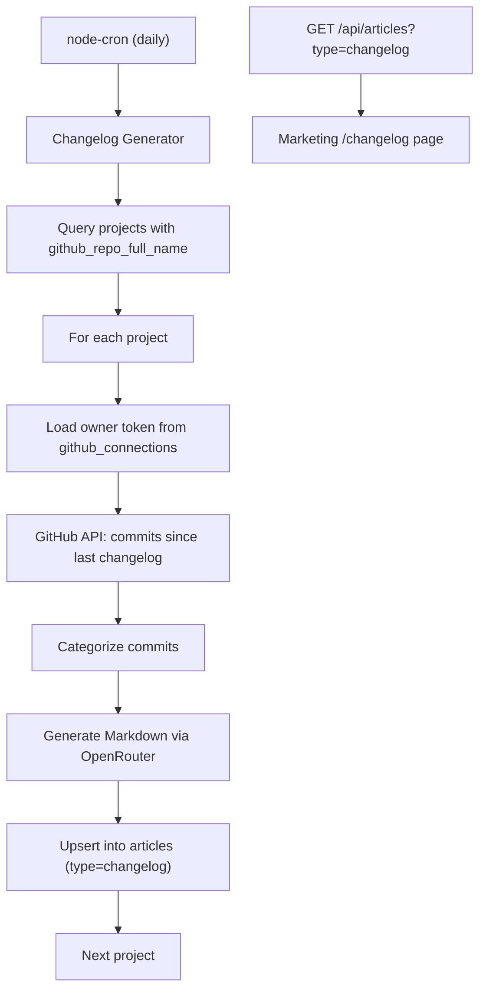

# Automated Changelog Generation and Display

## Data Flow



## 1. Database Migration

Add `'changelog'` to the articles `type` CHECK constraint.

**New file:** `supabase/migrations/YYYYMMDD_add_changelog_article_type.sql`

```sql
ALTER TABLE public.articles
  DROP CONSTRAINT articles_type_check,
  ADD CONSTRAINT articles_type_check CHECK (type IN ('article', 'feature', 'docs', 'changelog'));
```

## 2. Shared Schema Update

**File:** [`shared/schemas/article.ts`](shared/schemas/article.ts)

- Add `'changelog'` to `ArticleTypeEnum` (the Zod enum/union that currently contains `'article' | 'feature' | 'docs'`)

## 3. Backend: Scheduler + Changelog Generation

### 3a. Install `node-cron`

Add `node-cron` (and `@types/node-cron`) as dependencies in [`package.json`](package.json).

### 3b. Changelog Generator Module

**New file:** `server/jobs/changelogGenerator.ts`

Core logic:
1. Query `projects` where `github_repo_full_name IS NOT NULL`
2. For each project:
   - Load `access_token` from `github_connections` by `projects.user_id`
   - Skip if no token found
   - Query existing changelog article by tag `project:<id>` to find the last `published_at` date
   - Use `GitHubClient` (from [`server/lib/githubClient.ts`](server/lib/githubClient.ts)) to fetch commits on `github_repo_default_branch` since that date
   - Skip if no new commits
   - Categorize commits (conventional-commit prefix parsing: feat, fix, refactor, docs, chore, etc.)
   - Generate a Markdown summary via OpenRouter (reuse pattern from [`server/openrouter.ts`](server/openrouter.ts))
   - Upsert article row: match on `slug` (format: `changelog-<project-short-id>-<YYYY-MM-DD>`), set `type='changelog'`, `status='published'`, `tags=['changelog', 'project:<project-id>']`, `published_at=now()`, `content=<markdown>`
3. Wrap each project iteration in try/catch to skip on error
4. Apply exponential backoff on GitHub 429/5xx responses (already in `GitHubClient`)

### 3c. Cron Registration

**New file:** `server/jobs/index.ts`

- Export a `startScheduledJobs()` function that registers `node-cron` tasks
- Schedule: `'0 4 * * *'` (daily at 04:00 UTC)
- Call from [`server/index.ts`](server/index.ts) after server starts listening

### 3d. Internal Admin Trigger Endpoint

**New file:** `server/routes/changelog.ts`

- `POST /api/changelog/generate` (behind `requireAuth` + super-admin check)
- Manually triggers the changelog generator (useful for testing / backfill)
- Mount in `server/index.ts`

## 4. Frontend: Changelog Pages

### 4a. Changelog List Page

**New file:** `src/site/pages/ChangelogListPage.tsx`

- Fetch `publicGet<ArticleRow[]>('/api/articles?type=changelog')`
- Render entries grouped by date, showing project name (from title), excerpt, and link to detail
- Follow existing page shell pattern: `TopNav` + `PageGrid` + `CtaSection`
- Reuse `ArticleCard` in compact mode or create a simpler `ChangelogEntry` component if design differs significantly

### 4b. Changelog Detail

Reuse the existing [`ArticlePage.tsx`](src/site/pages/ArticlePage.tsx) — changelog articles have the same slug-based lookup and markdown rendering. The `/articles/:slug` route already works for any published article type.

Alternatively, add a dedicated `/changelog/:slug` route that renders the same `ArticlePage` component for cleaner URLs.

### 4c. Route Registration

**File:** [`src/site/main.tsx`](src/site/main.tsx)

- Add `<Route path="/changelog" element={<ChangelogListPage />} />`
- Add `<Route path="/changelog/:slug" element={<ArticlePage />} />` (reuses existing detail page)

### 4d. Navigation Update

**File:** [`src/site/components/TopNav.tsx`](src/site/components/TopNav.tsx)

- Add `{ label: 'Changelog', href: '/changelog' }` to `RESOURCES_ITEMS` array

## 5. Upsert Logic Detail

The slug `changelog-<short_id>-<YYYY-MM-DD>` serves as the natural key for deduplication. The generator uses Supabase's `.upsert()` with `onConflict: 'slug'`:
- If the slug already exists: update `content`, `updated_at`, `published_at`
- If not: insert a new row

This satisfies the "duplicate date+project entries update instead of insert" constraint.

## 6. Key Design Decisions

| Decision | Choice | Rationale |
|----------|--------|-----------|
| Scheduling | `node-cron` in Express process | Simplest; server runs continuously on Render; no new infra needed |
| Project linking | Tags array (`project:<id>`) | Uses existing GIN-indexed `tags` column; no schema changes beyond type constraint |
| Content generation | OpenRouter summarization | Consistent with existing article generation; produces human-readable changelogs |
| Detail page | Reuse `ArticlePage` | Avoids duplicating markdown rendering; changelogs are just articles with type=changelog |
| Slug format | `changelog-<short_id>-<YYYY-MM-DD>` | Natural dedup key; human-readable URLs |

## 7. Files Changed/Created Summary

**Modified:**
- `supabase/migrations/` — new migration file
- `shared/schemas/article.ts` — add 'changelog' type
- `server/index.ts` — mount changelog route, call `startScheduledJobs()`
- `src/site/main.tsx` — add /changelog routes
- `src/site/components/TopNav.tsx` — add Changelog to Resources
- `package.json` — add `node-cron` dependency

**Created:**
- `server/jobs/changelogGenerator.ts` — generation logic
- `server/jobs/index.ts` — cron registration
- `server/routes/changelog.ts` — manual trigger endpoint
- `src/site/pages/ChangelogListPage.tsx` — public list page
