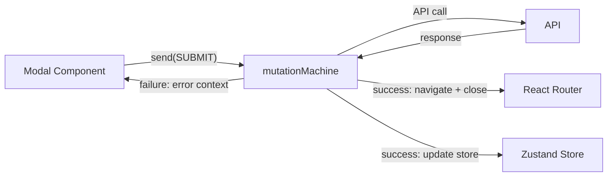

# CRUD State Machines

## Problem

Every mutation flow (create, rename, delete, link, invite) is currently an ad-hoc `useState` + `await` pattern inside modal components. This violates master rules on explicit state machines (section 9), separation of concerns (section 2), race condition avoidance (section 10), and explicit errors (section 16). Navigation after mutations is fragile and timing-dependent.

## Architecture

Each CRUD flow becomes a small, focused XState machine. Zustand continues to own domain data. Machines own the mutation lifecycle: `idle -> submitting -> success/failure`, with navigation and error surfacing as transition effects.



## Pattern (per master rules)

Every machine follows the `routerResolver` template:

- **`*.machine.ts`** � `setup({ types, guards }).createMachine(...)` with factory function receiving an `Actions` interface
- **`use*.ts`** � React hook bridging modal state, store, and router into the machine via `useMachine` + `send`
- **Pure context** � `assign()` for state; side effects via `actions.*` closure
- **Explicit states** � `idle`, `validating`, `submitting`, `success`, `failure` (named, finite, deterministic per section 9)
- **Errors visible** � failure state holds error message in context, surfaced to UI (section 16)
- **Logging** � every transition logs start/success/failure (section 19)
- **No silent failures** � every catch surfaces to the machine's failure state

## File Structure

```
src/app/machines/
  routerResolver.machine.ts      (existing)
  useRouterResolver.ts            (existing)
  mutations/
    createWorkspace.machine.ts
    useCreateWorkspace.ts
    createProject.machine.ts
    useCreateProject.ts
    createTeam.machine.ts
    useCreateTeam.ts
    renameEntity.machine.ts       (shared: workspace/team/project rename)
    useRenameEntity.ts
    deleteEntity.machine.ts       (shared: workspace/team/project deactivate)
    useDeleteEntity.ts
    sendInvitation.machine.ts
    useSendInvitation.ts
    linkIntegration.machine.ts    (shared: GitHub/Linear/Supabase/Slack link)
    useLinkIntegration.ts
    createEntity.machine.ts       (shared: requirement/question/answer create)
    useCreateEntity.ts
```

## Machines to Build (grouped by complexity)

### Tier 1 � Simple create-and-navigate (highest priority, fixes current bugs)

These are the flows that currently have broken navigation.

**1. `createWorkspace.machine.ts`**
- States: `idle` -> `submitting` -> `success` (navigate to new workspace slug) | `failure`
- Actions: `api.createWorkspace`, `navigate(buildWorkspacePath)`, `store.addWorkspace`
- Currently in: [CreateWorkspaceModal.tsx](src/app/components/CreateWorkspaceModal.tsx)

**2. `createProject.machine.ts`**
- States: `idle` -> `submitting` -> `success` (navigate to new project path) | `failure`
- Actions: `api.createProject`, `navigate(buildProjectPath)`, `store.addProject`
- Must handle sub-project creation (parentId) and team resolution for path building
- Currently in: [NewProjectModal.tsx](src/app/components/NewProjectModal.tsx)

**3. `createTeam.machine.ts`**
- States: `idle` -> `submitting` -> `success` (close modal, refresh sidebar) | `failure`
- Actions: `api.createTeam`, `store.addTeam`
- Currently in: [CreateTeamModal.tsx](src/app/components/CreateTeamModal.tsx)

### Tier 2 � Optimistic mutations (rename, update)

**4. `renameEntity.machine.ts`** (shared for workspace/team/project)
- States: `idle` -> `validating` -> `submitting` -> `success` | `failure` (rollback)
- Parameterized by entity type via context
- Currently in: [RenameProjectModal.tsx](src/app/components/RenameProjectModal.tsx), [RenameTeamModal.tsx](src/app/components/RenameTeamModal.tsx), [WorkspaceSettingsModal.tsx](src/app/components/WorkspaceSettingsModal.tsx)

### Tier 3 � Destructive operations

**5. `deleteEntity.machine.ts`** (shared for workspace/team/project deactivate)
- States: `idle` -> `confirming` -> `submitting` -> `success` (navigate if workspace deleted) | `failure`
- Currently in: [DeactivateModal.tsx](src/app/components/DeactivateModal.tsx), [WorkspaceSettingsModal.tsx](src/app/components/WorkspaceSettingsModal.tsx)

### Tier 4 � Invitation flow

**6. `sendInvitation.machine.ts`**
- States: `idle` -> `submitting` -> `success` (close + refresh list) | `failure` (inline error)
- Currently in: [InviteMemberModal.tsx](src/app/components/InviteMemberModal.tsx), [AddUserPopover.tsx](src/app/components/AddUserPopover.tsx)

### Tier 5 � Integration linking

**7. `linkIntegration.machine.ts`** (shared for GitHub/Linear/Supabase/Slack)
- States: `idle` -> `linking` -> `fetchingContext` -> `success` | `failure`
- Parameterized by integration type
- Currently in: [LinkRepoModal.tsx](src/app/components/LinkRepoModal.tsx), [LinkLinearModal.tsx](src/app/components/LinkLinearModal.tsx), [LinkDatabaseModal.tsx](src/app/components/LinkDatabaseModal.tsx), [LinkSlackChannelModal.tsx](src/app/components/LinkSlackChannelModal.tsx)

### Tier 6 � Entity CRUD (requirements/questions/answers)

**8. `createEntity.machine.ts`** (shared for requirement/question/answer)
- States: `idle` -> `validating` -> `submitting` -> `success` | `failure`
- Requirement creation includes optional AI enhance step: `idle` -> `enhancing` -> `reviewing` -> `submitting`
- Currently in: [NewRequirementModal.tsx](src/app/components/NewRequirementModal.tsx) (3-step wizard), [NewQuestionModal.tsx](src/app/components/NewQuestionModal.tsx), [NewAnswerModal.tsx](src/app/components/NewAnswerModal.tsx)

## Implementation Rules (from master rules + architecture)

1. **SSOT** � Machine context is the single owner of mutation lifecycle state (isSubmitting, error, validationError). Remove all `useState` for these from modals.
2. **Separation** � Modals become pure UI: render from `state.context`, dispatch `send({ type: 'SUBMIT', ... })`. No `await` in components.
3. **No hardcoding** � Error messages from API, not hardcoded strings.
4. **Race conditions** � Machine prevents double-submit (no SUBMIT transition from `submitting` state). Cancellation via machine stop on unmount.
5. **Errors** � Every failure state includes `error: string` in context, surfaced in the modal UI. No silent failures.
6. **Logging** � `log.info` on submit, `log.info` on success, `log.error` on failure (section 19).
7. **Navigation** � Success transitions that navigate use `actions.navigate()` from the factory closure, same pattern as routerResolver.

## What Stays in Zustand

- Domain data arrays (workspaces, projects, teams, etc.)
- Async data loaders (loadProjects, loadTeams, etc.)
- Selection state (selectedProjectId, etc.)
- Optimistic update + rollback logic (stays in store actions, called by machine)

## What Moves to XState

- Mutation lifecycle (idle/submitting/success/failure)
- Validation before submit
- Navigation after success
- Error state management
- Double-submit prevention
- Multi-step flows (requirement enhance wizard)

## Order of Implementation

1. **Tier 1** first (createWorkspace, createProject, createTeam) � fixes the current navigation bugs
2. **Tier 2-3** next (rename, delete) � fixes silent failure issues
3. **Tier 4-6** last (invitations, integrations, entities) � completeness

## Affected Files (full inventory)

### Modals to refactor
- `src/app/components/CreateWorkspaceModal.tsx`
- `src/app/components/NewProjectModal.tsx`
- `src/app/components/CreateTeamModal.tsx`
- `src/app/components/RenameProjectModal.tsx`
- `src/app/components/RenameTeamModal.tsx`
- `src/app/components/DeactivateModal.tsx`
- `src/app/components/InviteMemberModal.tsx`
- `src/app/components/AddUserPopover.tsx`
- `src/app/components/LinkRepoModal.tsx`
- `src/app/components/LinkLinearModal.tsx`
- `src/app/components/LinkDatabaseModal.tsx`
- `src/app/components/LinkSlackChannelModal.tsx`
- `src/app/components/SlackChannelPicker.tsx`
- `src/app/components/NewRequirementModal.tsx`
- `src/app/components/NewQuestionModal.tsx`
- `src/app/components/NewAnswerModal.tsx`
- `src/app/components/DetailsModal.tsx`
- `src/app/components/WorkspaceSettingsModal.tsx`

### Store slices (keep data, machines call into them)
- `src/app/store/slices/workspaces.ts`
- `src/app/store/slices/projects.ts`
- `src/app/store/slices/entities.ts`
- `src/app/store/slices/github.ts`
- `src/app/store/slices/linear.ts`
- `src/app/store/slices/slack.ts`
- `src/app/store/slices/supabaseConnect.ts`
- `src/app/store/slices/summaries.ts`
