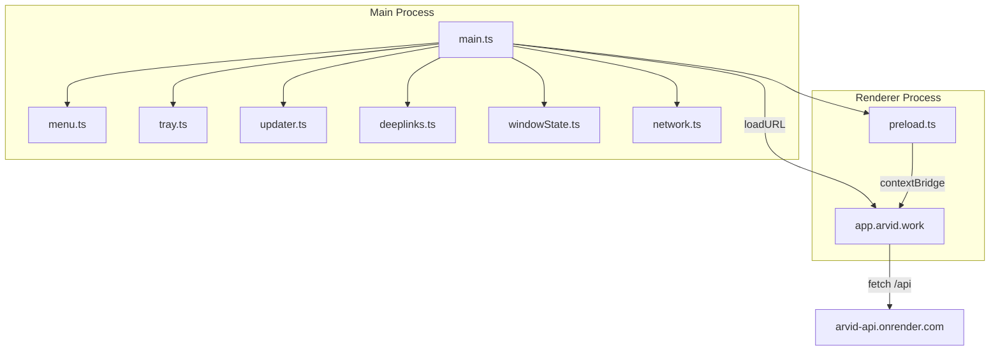

# Electron macOS Desktop Shell

## Architecture Overview

The Electron shell loads the **remote** dashboard SPA (`https://app.arvid.work`) in a `BrowserWindow`. No static files are bundled -- web deploys to Render automatically update what desktop users see. The Electron shell only needs new releases when native behavior changes (menu, tray, deep links, updater logic).

The main process handles native concerns (menu, tray, updates, deep links, network); the renderer is the live web app.



## Key Benefit: Single Deploy Pipeline

Since the Electron shell loads the remote web app, the existing Render deploy pipeline remains the single source of truth for SPA releases. Feature work, bug fixes, and UI changes are deployed once to Render and immediately available in both the browser and the desktop app. The Electron project only needs a new `.dmg` release for changes to native shell behavior (menu items, tray, deep link handling, update mechanism, window chrome).

## Directory Structure

```
electron/
  main.ts           -- App lifecycle, window creation, module wiring
  preload.ts        -- contextBridge exposing IPC to renderer
  menu.ts           -- macOS application menu
  tray.ts           -- System tray icon + context menu
  updater.ts        -- Manual update check via electron-updater
  deeplinks.ts      -- arvid:// protocol registration + route handling
  windowState.ts    -- Persist/restore window bounds via electron-store
  network.ts        -- Online/offline detection + native dialog
  tsconfig.json     -- Separate TS config targeting Node for main process
electron-builder.yml  -- electron-builder packaging config
resources/
  icon.icns         -- macOS app icon
  tray-icon.png     -- 16x16 / 32x32 tray template image
```

## Key Design Decisions

### Loading the SPA: Remote URL

The `BrowserWindow` loads `https://app.arvid.work` directly. This eliminates the need for a custom protocol handler, avoids bundling `dist/` into the Electron package, and means every web deploy is instantly reflected in the desktop app.

A branded splash/loading screen is shown in the window background while the remote page loads (matching the app's dark theme). The `did-finish-load` event on the `webContents` hides the splash once the SPA is ready.

For **local development**, the window loads `http://localhost:5173` (the Vite dev server) instead, controlled by an environment variable.

```typescript
const APP_URL = process.env.ELECTRON_DEV
  ? 'http://localhost:5173'
  : 'https://app.arvid.work';

mainWindow.loadURL(APP_URL);
```

### External Navigation Guard

Since the renderer loads a remote URL, we must prevent the window from navigating away to arbitrary external sites (OAuth redirects, link clicks, etc.). The main process intercepts navigation via `will-navigate` and `new-window` events:
- Same-origin navigation (`app.arvid.work`): allowed
- OAuth callbacks and API redirects: allowed via allowlist
- Everything else: opened in the default system browser via `shell.openExternal`

### Deep Links: Mirror SPA Routes

Deep links use the `arvid://` scheme and mirror the SPA route structure directly. `arvid:///abc/def/ghi` navigates the BrowserWindow to `https://app.arvid.work/abc/def/ghi`. Registration happens via `app.setAsDefaultProtocolClient('arvid')` and events are handled in `open-url` (macOS).

### Theme / Dark Mode

On first launch (no localStorage value), the preload script exposes `nativeTheme.shouldUseDarkColors` so the SPA's existing `initTheme()` can default to the system preference instead of always defaulting to dark. The main process listens for `nativeTheme` `updated` events and forwards them to the renderer via IPC. The SPA's existing `useTheme` hook handles the actual toggle; Electron just provides the system signal.

### Auto-Updates: Manual Prompt (Shell Only)

Since the app is unsigned, silent auto-update is not feasible. `electron-updater` checks a `latest-mac.yml` manifest hosted on Render. If a newer **shell** version exists, a native `dialog.showMessageBox` prompts the user to download. Clicking "Download" opens the browser to the `.dmg` URL. These updates are infrequent -- only when native shell behavior changes.

### Window State Persistence

`electron-store` persists `{ x, y, width, height, isMaximized }` to `~/Library/Application Support/Arvid/window-state.json`. Restored on launch with bounds validation (ensures window is on a visible display).

## Dependencies to Add

- `electron` -- runtime (devDependency)
- `electron-builder` -- .dmg packaging (devDependency)
- `electron-updater` -- update checking (dependency)
- `electron-store` -- window state persistence (dependency)
- `tsup` -- bundle main process TS (devDependency)

## Build Pipeline

Since no SPA bundling is needed, the Electron build is independent of the web build:

1. `tsup electron/main.ts electron/preload.ts --format cjs --outDir electron/dist` -- bundle main process
2. `electron-builder --mac` -- package into `.dmg`

New npm scripts in [package.json](package.json):
```
"electron:dev": "ELECTRON_DEV=1 tsup electron/main.ts electron/preload.ts --format cjs --outDir electron/dist && electron electron/dist/main.js"
"electron:build": "tsup electron/main.ts electron/preload.ts --format cjs --outDir electron/dist && electron-builder --mac"
```

## electron-builder Configuration

In `electron-builder.yml`:
```yaml
appId: com.arvid.desktop
productName: Arvid
mac:
  category: public.app-category.developer-tools
  target: dmg
  icon: resources/icon.icns
  protocols:
    - name: Arvid
      schemes: [arvid]
dmg:
  title: Arvid
  contents:
    - x: 130
      y: 220
    - x: 410
      y: 220
      type: link
      path: /Applications
files:
  - electron/dist/**/*
  - resources/**/*
  - package.json
extraMetadata:
  main: electron/dist/main.js
directories:
  output: release
publish:
  provider: generic
  url: https://arvid-api.onrender.com/api/updates/mac
```

Note: `dist/` (Vite output) is **not** included in `files` -- the app loads the remote URL.

## Electron `tsconfig.json`

Separate config at `electron/tsconfig.json` targeting Node:
```json
{
  "compilerOptions": {
    "target": "ES2022",
    "module": "CommonJS",
    "moduleResolution": "node",
    "strict": true,
    "esModuleInterop": true,
    "skipLibCheck": true,
    "outDir": "./dist",
    "rootDir": "."
  },
  "include": ["./**/*.ts"]
}
```

## Module Details

### main.ts
- `app.whenReady()`: restore window state, create `BrowserWindow`, load remote URL, attach menu, init tray, check for updates, register deep link handler
- `BrowserWindow` config: `webPreferences.preload`, `titleBarStyle: 'hiddenInset'` (native traffic lights), `minWidth: 960`, `minHeight: 640`, dark background color for splash
- External navigation guard on `will-navigate` and `new-window`
- `app.on('window-all-closed')`: no-op on macOS (standard behavior)
- `app.on('activate')`: re-show or recreate window

### preload.ts
- Exposes via `contextBridge.exposeInMainWorld('electronAPI', { ... })`:
  - `getSystemTheme(): 'dark' | 'light'`
  - `onThemeChange(callback): void`
  - `getAppVersion(): string`
  - `onDeepLink(callback): void`
  - `onNetworkStatus(callback): void`
- Preload must work on the remote origin -- `webPreferences.preload` is loaded regardless of the page URL

### menu.ts
- Standard macOS menu: App (About, Preferences separator, Quit), Edit (Undo/Redo/Cut/Copy/Paste/Select All), View (Reload, Toggle DevTools, Zoom), Window (Minimize, Zoom, Close)
- Preferences opens in-app account settings route

### tray.ts
- Template image for macOS menu bar (auto dark/light)
- Context menu: "Show Arvid" (focus window), separator, "Quit Arvid"

### network.ts
- Main process uses `net.online` (Electron's built-in) plus the `online-status-changed` event
- On offline detection: `dialog.showMessageBox` with "Retry" and "Quit" buttons
- On "Retry": re-check connectivity, reload the page if back online
- Also handles the case where `loadURL` itself fails (no network on launch) -- shows the splash with a retry prompt

### updater.ts
- On app launch (after 5s delay) and then every 4 hours, fetch `latest-mac.yml` from Render
- Compare `version` field against `app.getVersion()`
- If newer: `dialog.showMessageBox({ message: 'A new version of Arvid is available', buttons: ['Download', 'Later'] })`
- "Download" opens the `.dmg` URL in default browser via `shell.openExternal`

## SPA Changes (Minimal)

The SPA itself requires **no routing or component changes**. One small integration:

**Theme bridge** (in [src/app/hooks/useTheme.ts](src/app/hooks/useTheme.ts)): If `window.electronAPI` exists, use `electronAPI.getSystemTheme()` as the default when no localStorage value is set, and subscribe to `electronAPI.onThemeChange()` to optionally sync.

No changes needed for `VITE_API_BASE` -- since the app loads from `app.arvid.work`, the existing relative `/api` fallback doesn't apply; the Render-deployed build already has `VITE_API_BASE` set to the full API URL.

## Render Changes

No changes to `render.yaml` for MVP. Update artifacts (`.dmg`, `latest-mac.yml`) can be hosted as GitHub Releases or manually uploaded. If using the API server, add a simple static-file route at `/api/updates/mac/` that serves the manifest and download URL.

## What Is NOT In Scope (MVP)

- Code signing / notarization (user must bypass Gatekeeper on first launch)
- Silent auto-update (requires signing)
- Offline mode / service worker caching
- Windows / Linux builds
- Touch Bar support
- Crash reporting
- Analytics / telemetry
