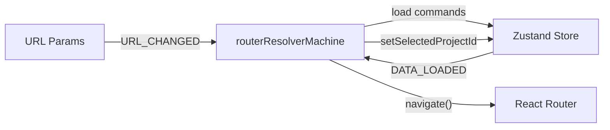
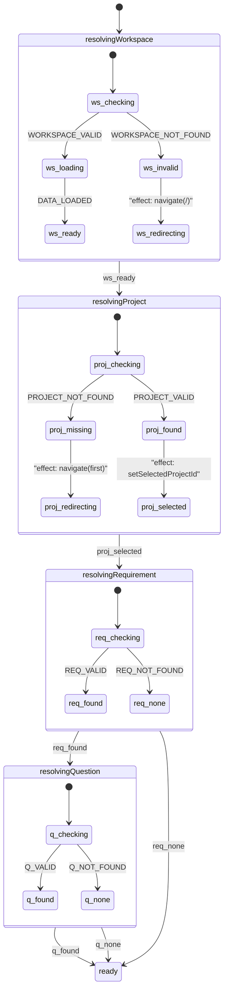

# Fix Navigation Loop — Hierarchical FSM with XState v5

## Root Cause

`WorkspaceLayout.tsx` uses multiple competing `useEffect` hooks that each call `navigate()`. React's effect batching means closures capture stale state, and one effect's navigate triggers another effect's re-fire. No amount of guards can fix this because **effects are not a state machine**.

## Architecture

XState v5 owns **orchestration, resolution, and navigation lifecycle**. Zustand continues to own **domain data** (entities, projects, teams, workspaces). They communicate via events.



## State Machine Design

Hierarchical machine with 4 sequential resolution levels. Each level resolves or redirects before the next begins. Parent changes invalidate all children.



Key properties:
- **Effects are on transitions** (navigate, setSelection), not standalone states
- **Loading is an explicit state** (`ws_loading`) with a clear exit event (`DATA_LOADED`)
- **Navigate is a transition effect** that moves to `redirecting` state — machine waits for `URL_CHANGED` to re-enter
- **Parent invalidation** — `URL_CHANGED` with new workspace re-enters from top, abandoning downstream

## File Structure

```
src/app/machines/
  routerResolver.machine.ts   — XState machine definition
  routerResolver.types.ts     — context, events, types
  useRouterResolver.ts        — React hook bridging URL + Zustand + machine
```

## Implementation

### `src/app/machines/routerResolver.types.ts`

```typescript
export interface RouterResolverContext {
  wsShortId: string | undefined;
  teamShortId: string | undefined;
  projectShortId: string | undefined;
  reqShortId: string | undefined;
  questionShortId: string | undefined;
  resolvedWorkspaceId: string | null;
  resolvedProjectId: string | null;
}

export type RouterResolverEvent =
  | { type: 'URL_CHANGED'; wsShortId?: string; teamShortId?: string; projectShortId?: string; reqShortId?: string; questionShortId?: string }
  | { type: 'DATA_LOADED'; workspaceId: string }
  | { type: 'ENTITIES_LOADED' };
```

### `src/app/machines/routerResolver.machine.ts`

XState v5 `setup().createMachine()` with:
- `resolvingWorkspace` → checks workspace exists in store, triggers `loadProjects`/`loadTeams`, waits for `DATA_LOADED`
- `resolvingProject` → checks project exists in loaded projects, either selects or redirects
- `resolvingRequirement` / `resolvingQuestion` → resolve from entities data
- All `navigate()` calls are actions on transitions, followed by a `waitingForUrl` state that only exits on `URL_CHANGED`
- `URL_CHANGED` event always re-enters from top (workspace) — this is how parent invalidation works

### `src/app/machines/useRouterResolver.ts`

```typescript
export function useRouterResolver() {
  const params = useParams();
  const navigate = useNavigate();
  const store = useStore;  // store reference, not hook

  const [state, send, actorRef] = useMachine(routerResolverMachine, {
    // Provide actions that reference navigate() and store.getState()/setState()
  });

  // URL changes → send event to machine
  useEffect(() => {
    send({ type: 'URL_CHANGED', ...params });
  }, [params.wsShortId, params.projectShortId, params.reqShortId, params.questionShortId, send]);

  // Zustand data readiness → send event to machine
  useEffect(() => {
    return useStore.subscribe((s, prev) => {
      if (s.projectsDataState.status === 'ready' && s.teamsDataState.status === 'ready') {
        if (prev.projectsDataState.status !== 'ready' || prev.teamsDataState.status !== 'ready') {
          send({ type: 'DATA_LOADED', workspaceId: s.activeWorkspaceId! });
        }
      }
    });
  }, [send]);

  return state;
}
```

### `src/app/components/WorkspaceLayout.tsx` — becomes trivial

```typescript
export function WorkspaceLayout() {
  useRouterResolver();
  return <Outlet />;
}
```

### `src/app/components/WorkspaceRedirect.tsx`

Stays unchanged — handles only the `/` → first workspace redirect on boot.

## What Stays in Zustand

- `workspaces`, `projects`, `teams`, `members`, `invitations` (domain data)
- `requirements`, `questions`, `answers` (entities)
- `loadProjects()`, `loadTeams()`, `loadEntities()` (async fetchers)
- `selectedProjectId`, `selectedReqId`, `selectedQuestionId` (selection state — written by machine actions)
- `setActiveWorkspace()` (clears downstream data)

## What XState Owns

- Resolution lifecycle (which level is being resolved)
- Whether to navigate (and where)
- Whether to wait for data
- Parent invalidation cascades
- The decision of "what to do next"

## Why This Definitively Fixes the Loop

1. **State machine is deterministic** — same inputs always produce same output, no stale closures
2. **Navigate is a transition effect** — fires once, then machine waits in `waitingForUrl` state until `URL_CHANGED` arrives with new params
3. **Loading is an explicit state** — machine sits in `ws_loading` until `DATA_LOADED` event. No polling, no re-renders, no stale checks
4. **Parent invalidation is structural** — `URL_CHANGED` with new workspace always re-enters from top, automatically abandoning downstream states
5. **No competing effects** — one machine, one subscription, zero `navigate()` races

## Dependencies

```bash
npm install xstate @xstate/react
```

XState v5.28+, @xstate/react v6.1+. Both well-maintained, tree-shakeable, ~12KB gzipped.
