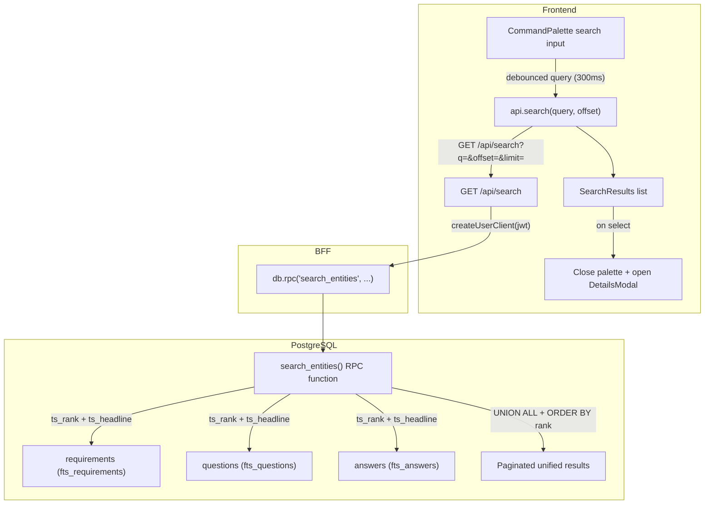

# Full-Text Search Across Requirements and Q&A

## Current State

The Command Palette ([src/app/components/command-palette/CommandPalette.tsx](src/app/components/command-palette/CommandPalette.tsx)) is a `cmdk`-based modal opened via `Cmd+K`. It searches only static in-memory commands via Fuse.js. There is no server-side full-text search. The spec calls for adding a **search mode** to this modal that queries the database across requirements, questions, and answers.

## Architecture



## 1. Database Migration

**File:** New `supabase/migrations/YYYYMMDDHHMMSS_add_full_text_search.sql`

### Generated tsvector columns

Add stored generated `tsvector` columns to each table, avoiding runtime computation:

- **requirements**: `fts tsvector GENERATED ALWAYS AS (to_tsvector('english', coalesce(title,'') || ' ' || coalesce(owner,'') || ' ' || coalesce(description,''))) STORED`
- **questions**: `fts tsvector GENERATED ALWAYS AS (to_tsvector('english', coalesce(text,'') || ' ' || coalesce(author,'') || ' ' || coalesce(description,''))) STORED`
- **answers**: `fts tsvector GENERATED ALWAYS AS (to_tsvector('english', coalesce(text,'') || ' ' || coalesce(author,''))) STORED`

### GIN indexes

```sql
CREATE INDEX idx_requirements_fts ON requirements USING GIN (fts);
CREATE INDEX idx_questions_fts ON questions USING GIN (fts);
CREATE INDEX idx_answers_fts ON answers USING GIN (fts);
```

### RPC function: `search_entities`

A `SECURITY INVOKER` function (so RLS is enforced via the calling user's JWT) that:

1. Accepts `p_query text`, `p_limit int DEFAULT 50`, `p_offset int DEFAULT 0`
2. Truncates query to 500 chars, converts to `tsquery` using `websearch_to_tsquery('english', p_query)` for partial/case-insensitive matching
3. Runs three sub-queries (UNION ALL):
   - **requirements**: Joins `projects` to filter `is_deleted = false` and `is_deactivated = false`. Returns `entity_type = 'requirement'`, `id`, `short_id`, `title` (as label), `owner` (as author), `ts_rank(fts, query)` as rank, `ts_headline('english', title || ' ' || coalesce(description,''), query)` as snippet, plus `project_id`, `requirement_id = NULL`, `question_id = NULL`
   - **questions**: Joins `requirements` + `projects` for the same filters. Returns `entity_type = 'question'`, `short_id`, `text` as label, `author`, rank, headline snippet, `project_id`, `requirement_id`
   - **answers**: Joins `questions` + `requirements` + `projects`. Returns `entity_type = 'answer'`, `short_id`, truncated `text` as label, `author`, rank, headline snippet, `project_id`, `requirement_id`, `question_id`
4. Orders by `rank DESC`, applies `LIMIT p_limit OFFSET p_offset`
5. Returns `SETOF` a composite type or JSON

The function lives in the `public` schema as `SECURITY INVOKER` so that the per-request `createUserClient(jwt)` Supabase client invokes it under the user's RLS context. This leverages the existing RLS policies on requirements, questions, and answers (which already chain through projects to check workspace membership via `private.user_workspace_ids()`).

## 2. Shared Schema

**File:** New `shared/schemas/search.ts`

```typescript
// Zod schemas for search results
SearchResultRowSchema = z.object({
  entity_type: z.enum(['requirement', 'question', 'answer']),
  entity_id: z.string(),
  short_id: z.string().nullable(),
  label: z.string(),
  author: z.string().nullable(),
  snippet: z.string().nullable(),
  rank: z.number(),
  project_id: z.string().nullable(),
  requirement_id: z.string().nullable(),
  question_id: z.string().nullable(),
});

SearchResultSchema = SearchResultRowSchema.transform(row => ({
  entityType: row.entity_type,
  entityId: row.entity_id,
  shortId: row.short_id,
  label: row.label,
  author: row.author,
  snippet: row.snippet,
  rank: row.rank,
  projectId: row.project_id,
  requirementId: row.requirement_id,
  questionId: row.question_id,
}));
```

**File:** [shared/schemas/index.ts](shared/schemas/index.ts) -- export new schemas

## 3. Server: Search Route

**File:** New `server/routes/search.ts`

Single GET endpoint following the existing route pattern:

```
GET /api/search?q=<query>&limit=50&offset=0
```

- Uses `createUserClient(req.accessToken!)` for RLS enforcement
- Calls `db.rpc('search_entities', { p_query, p_limit, p_offset })`
- Validates and returns the array of `SearchResultRow` objects
- Truncates `q` to 500 chars server-side
- Returns `[]` for empty/whitespace-only queries
- Errors return `500` with message

**File:** [server/index.ts](server/index.ts) -- mount `searchRouter` at `/api/search` (after `requireAuth` middleware)

## 4. Frontend: API Layer

**File:** [src/app/api.ts](src/app/api.ts)

Add a new method:

```typescript
async search(query: string, offset = 0, limit = 50, signal?: AbortSignal): Promise<SearchResult[]> {
  const params = new URLSearchParams({ q: query, offset: String(offset), limit: String(limit) });
  const rows = await request<unknown[]>('GET', `/search?${params}`, undefined, signal);
  return parseArray(SearchResultRowSchema, SearchResultSchema, rows, '/search');
}
```

## 5. Frontend: Search State

**File:** New `src/app/store/slices/search.ts`

A dedicated Zustand slice for search state (SSOT for search):

- `searchQuery: string` -- current search text
- `searchResults: SearchResult[]` -- accumulated results
- `searchStatus: 'idle' | 'loading' | 'ready' | 'error'` -- state machine
- `searchHasMore: boolean` -- whether more pages exist
- `searchOffset: number` -- cursor for pagination
- `performSearch(query: string): void` -- resets results, fires API call, updates state
- `loadMoreSearchResults(): void` -- increments offset, appends results
- `clearSearch(): void` -- resets all search state

Uses `AbortController` to cancel in-flight requests when a new search is triggered (race condition avoidance per master rule 10).

**File:** [src/app/store/index.ts](src/app/store/index.ts) -- compose new slice into `AppState`

## 6. Frontend: Command Palette Search Mode

The existing `CommandPalette` needs a **dual mode**: commands (current) and search (new). The approach:

### Mode Detection

When the input starts typing, if the text does not match any command (or after a short debounce), the palette switches from showing commands to showing search results. A simpler approach per the spec: the **same input** serves both modes. When search results are present, they appear **above** command results in a "Search Results" group.

### New Components (all in `src/app/components/command-palette/`)

- **`SearchResultItem.tsx`** -- Renders a single search result: entity type badge (R/Q/A), short_id, highlighted snippet (using `dangerouslySetInnerHTML` for `ts_headline` output which returns `<b>` tags), author. Styled with the same item pattern as `CommandItem`.
- **`SearchResultGroup.tsx`** -- Wraps search results in a `Command.Group` with "Search Results" heading, includes a loading spinner during fetch, empty state when no results match, and an "infinite scroll" trigger at the bottom (IntersectionObserver) that calls `loadMoreSearchResults()`.

### Integration into `CommandPalette.tsx`

- Add a `useEffect` with a 300ms debounce on `search` state that calls `performSearch(search)` from the store when the input has 2+ characters
- When `searchResults.length > 0`, render `SearchResultGroup` before the command groups
- On selecting a search result: close palette, navigate to the entity's project context, and open DetailsModal with the entity

### Navigation on Select

When a search result is selected:
1. Close the command palette (`closeCommandPalette()`)
2. If the result's `projectId` differs from `selectedProjectId`, switch to that project via `setSelectedProjectId(projectId)`
3. Select the requirement via `setSelectedReqId(requirementId)` (for questions/answers, use the parent requirement)
4. If question: `setSelectedQuestionId(questionId)`
5. Open the DetailsModal for the entity type and ID (via store action or direct state update)

This requires reading the existing `openDetailsModal` pattern. The DetailsModal is currently opened via local state in the parent component. We need to either:
- Add a `pendingDetailsModal` to the UI slice (similar to `pendingModal`) that any component can trigger, or
- Use `requestModal` with a new intent like `'viewDetails'` carrying `{ type, id }` data

The recommended approach is to add a new `ModalIntent` value `'viewDetails'` and handle it in the existing modal orchestration.

## 7. Highlighting

`ts_headline` returns HTML with `<b>` tags around matching terms. The `SearchResultItem` component renders this via a sanitized `dangerouslySetInnerHTML` in a `<span>`. The snippet container uses `text-text-secondary` with `[&_b]:text-text-primary [&_b]:font-[var(--fw-semibold)]` to style highlights.

## 8. Edge Cases

- **Empty query / whitespace**: Show commands only (no search API call)
- **Query < 2 chars**: No search, show commands
- **No results**: Show "No matching results" placeholder in the Search Results group
- **Query > 500 chars**: Truncated client-side before sending
- **Rapid typing**: AbortController cancels previous in-flight request
- **Deleted projects**: Filtered by the RPC function (`p.is_deleted = false`)
- **Deactivated requirements**: Filtered by the RPC function (`r.is_deactivated = false`)
- **API errors**: Toast via `sonner`, search status set to `'error'`

## Key Files Changed

- `supabase/migrations/YYYYMMDDHHMMSS_add_full_text_search.sql` -- new: tsvector columns, GIN indexes, RPC function
- `shared/schemas/search.ts` -- new: Zod schemas for search results
- [shared/schemas/index.ts](shared/schemas/index.ts) -- export new schemas
- `server/routes/search.ts` -- new: GET /api/search endpoint
- [server/index.ts](server/index.ts) -- mount search router
- [src/app/api.ts](src/app/api.ts) -- add `search()` method
- `src/app/store/slices/search.ts` -- new: search Zustand slice
- [src/app/store/index.ts](src/app/store/index.ts) -- compose search slice
- [src/app/store/selectors.ts](src/app/store/selectors.ts) -- add search selectors
- `src/app/components/command-palette/SearchResultItem.tsx` -- new: search result renderer
- `src/app/components/command-palette/SearchResultGroup.tsx` -- new: search results group with infinite scroll
- [src/app/components/command-palette/CommandPalette.tsx](src/app/components/command-palette/CommandPalette.tsx) -- integrate search mode
- [src/app/store/slices/ui.ts](src/app/store/slices/ui.ts) -- add `'viewDetails'` modal intent for navigation

## Risks

- **RPC under RLS**: The `SECURITY INVOKER` approach means the RPC function runs with the calling user's permissions. The existing RLS policies on requirements/questions/answers already chain through projects to workspace membership. This is the correct pattern, but it means the function cannot use `supabaseAdmin` -- it must use the per-request user client.
- **Performance at scale**: The three-way UNION ALL with ts_rank could be slow with very large datasets. The GIN indexes mitigate this. If performance becomes an issue, we can add materialized views or limit the search to the current workspace.
- **ts_headline HTML injection**: `ts_headline` output contains raw HTML. The `<b>` tags from PostgreSQL are safe, but any user-provided content (titles, text) could contain HTML. We should use `ts_headline` with `HighlightAll=true` options and ensure the snippet is rendered in a span that does not process scripts (React's `dangerouslySetInnerHTML` handles this safely in practice since React does not execute scripts in innerHTML).
- **Migration on existing data**: Adding generated tsvector columns triggers a table rewrite. For the current scale this is fine, but should be tested on a staging database first.
