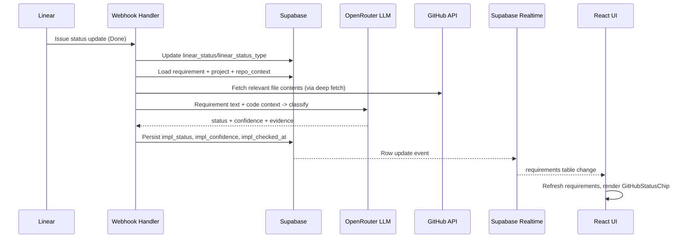

# GitHub Code Implementation Status on Requirement Cards

## Architecture Overview



## Data Flow

The feature piggybacks on the existing Linear webhook handler in [server/routes/webhooks.ts](server/routes/webhooks.ts). When a Linear issue transitions to a `completed` state type, the webhook triggers an async implementation check. Results are persisted as new columns on the `requirements` table and surfaced in the UI via Supabase Realtime (already wired in [src/app/App.tsx](src/app/App.tsx)).

---

## 1. Database -- New Columns on `requirements`

Add three columns to the `requirements` table in Supabase:

- `impl_status` -- `text`, nullable, one of: `'Not Checked'`, `'Implemented'`, `'Partially Implemented'`, `'Not Implemented'`, `'No Repo'`, `'Unknown'`
- `impl_confidence` -- `real` (float), nullable, 0.0-1.0
- `impl_checked_at` -- `timestamptz`, nullable

No new tables. No foreign keys. These are nullable so existing rows are unaffected. The Supabase Realtime publication on `requirements` already covers these columns automatically.

**SQL migration** (run via Supabase Dashboard or MCP):

```sql
ALTER TABLE requirements
  ADD COLUMN impl_status text,
  ADD COLUMN impl_confidence real,
  ADD COLUMN impl_checked_at timestamptz;
```

---

## 2. Shared Schema -- [shared/schemas/requirement.ts](shared/schemas/requirement.ts)

Update `RequirementRowSchema` to include the new columns:

```typescript
impl_status: z.enum([
  'Not Checked', 'Implemented', 'Partially Implemented', 'Not Implemented', 'No Repo', 'Unknown'
]).nullable().optional(),
impl_confidence: z.number().nullable().optional(),
impl_checked_at: z.string().nullable().optional(),
```

Update `RequirementSchema` transform to map to camelCase: `implStatus`, `implConfidence`, `implCheckedAt`.

Add the enum to [shared/schemas/enums.ts](shared/schemas/enums.ts) as `ImplStatusEnum` for reuse.

---

## 3. Server -- LLM Implementation Checker

### 3a. New module: `server/analysis/implChecker.ts`

A focused module that:
- Accepts a requirement context (title, description, questions/answers) and repo context (file tree, key files, analysis, recent commits)
- Builds an LLM prompt asking the model to classify implementation status
- Returns `{ status, confidence, evidence }` -- evidence is a brief string explaining the determination (stored optionally, or logged)

**LLM prompt strategy:**
- System prompt establishes the role: "You are a code implementation auditor"
- User prompt provides: requirement title + description, answered questions as spec details, file tree summary, key file contents (filtered by relevance), recent commit messages
- Output schema: JSON with `status` (enum), `confidence` (0-1), `evidence` (string)
- Uses existing `buildCodebaseContextBlock()` from [server/openrouter.ts](server/openrouter.ts) as a starting point
- Calls OpenRouter with the same model (`x-ai/grok-4.1-fast`) and API patterns

**Edge cases:**
- No linked repo on project: return `'No Repo'` immediately, skip LLM
- `repo_contexts` not in `'ready'` state: return `'Unknown'` with low confidence
- LLM timeout/error: return `'Unknown'`, log error
- Token limit concern: send file tree (paths only), key files (truncated), and up to 10 recent commits -- not full codebase

### 3b. New function exported from `server/openrouter.ts`

Add `classifyImplementation(input: ImplementationCheckInput): Promise<ImplementationCheckResult>` following the existing pattern of `generateSummary`, `classifyQuestion`, etc. This keeps all LLM orchestration in one module. Add Zod response schema `ImplementationCheckResponseSchema` in [shared/schemas/index.ts](shared/schemas/index.ts).

### 3c. New route: `POST /api/requirements/:id/check-implementation`

In [server/routes/requirements.ts](server/routes/requirements.ts):
- Authenticated endpoint for manual trigger / retry
- Loads requirement via user client, loads project + repo_context
- Calls `classifyImplementation`
- Persists result to `requirements` table
- Returns the new status

### 3d. Webhook trigger -- [server/routes/webhooks.ts](server/routes/webhooks.ts)

Extend the existing Linear webhook handler:
- After updating `linear_status` / `linear_status_type`, check if `stateType === 'completed'`
- If yes, fire-and-forget an async implementation check (do not block the webhook response -- Linear expects fast 200)
- The async function loads requirement, project, repo_context via service client, calls `classifyImplementation`, persists result
- If the status type transitions away from `completed` (e.g., reopened), clear the `impl_*` columns

```
webhooksRouter.post('/linear', async (req, res) => {
  // ... existing signature verification and status update ...

  // After successful status update:
  if (stateType === 'completed') {
    checkImplementationAsync(linearIssueId).catch(err => {
      console.error('[ERROR] [webhooks:implCheck] ...', err.message);
    });
  }

  res.sendStatus(200);
});
```

---

## 4. Frontend -- UI Components

### 4a. New component: `src/app/components/GitHubStatusChip.tsx`

Follows the `LinearStatusPill` pattern exactly -- a thin wrapper around `Chip`:

- Props: `implStatus`, `implConfidence`, `implCheckedAt`, optional `onRetry`
- Uses `Chip` with `border="dashed"`, accent mapped from status:
  - `'Implemented'` -> `'success'`
  - `'Partially Implemented'` -> `'warning'`
  - `'Not Implemented'` -> `'error'`
  - `'Not Checked'` / `'No Repo'` / `'Unknown'` -> `'default'`
- Displays GitHub mark icon (add `/github.svg` to `public/`) + status label
- Tooltip (via `title` attribute) shows confidence percentage and check timestamp when available
- When status is `'Unknown'` or `'Not Checked'`, renders as a button with `onClick={onRetry}` for manual trigger/retry

### 4b. Update `RequirementColumn` -- [src/app/components/RequirementColumn.tsx](src/app/components/RequirementColumn.tsx)

In `renderRequirement`, add `GitHubStatusChip` alongside `LinearStatusPill` in the existing `flex items-center gap-2` row (line 119-122):

```tsx
<div className="flex items-center gap-2 flex-wrap">
  <CompletenessChip value={liveCompleteness} />
  <LinearStatusPill ... />
  <GitHubStatusChip
    implStatus={req.implStatus ?? 'Not Checked'}
    implConfidence={req.implConfidence}
    implCheckedAt={req.implCheckedAt}
    onRetry={() => retryImplCheck(req.id)}
  />
</div>
```

Always renders on every card. When `implStatus` is null (no check has run), defaults to `'Not Checked'`.

### 4c. API client -- [src/app/api.ts](src/app/api.ts)

Add `checkImplementation(requirementId: string)` method for manual retry, calling `POST /api/requirements/:id/check-implementation`.

### 4d. Store -- [src/app/store/slices/entities.ts](src/app/store/slices/entities.ts)

Add `checkImplementation(requirementId: string)` action:
- Calls `api.checkImplementation(requirementId)`
- Updates the requirement in local state with the returned `implStatus`, `implConfidence`, `implCheckedAt`
- Track in-flight checks via a `checkingImplementation: Set<string>` to prevent concurrent checks on the same requirement

No separate polling or Realtime subscription is needed -- the existing Realtime subscription on `requirements` in `App.tsx` already calls `refreshRequirements` on any row update, which will pick up webhook-driven changes.

---

## 5. Visibility and Trigger Rules

### Chip Visibility (always visible)

The `GitHubStatusChip` renders on **every** requirement card regardless of Linear status or repo connection:

- **No check performed yet** (`implStatus` is null): show chip with a `'Not Checked'` default label, `'default'` accent -- indicates analysis has not run
- **No repo connected** (`implStatus` is `'No Repo'`): show chip with `'No Repo'` label, `'default'` accent
- **Check completed**: show the determined status (`'Implemented'`, `'Partially Implemented'`, `'Not Implemented'`, `'Unknown'`) with the corresponding accent

This means the chip is always present as a companion to `LinearStatusPill` and `CompletenessChip`, giving a consistent three-chip status row on every card.

### Analysis Trigger (only on Linear Done)

The LLM implementation check is **only triggered** when the Linear webhook reports `stateType === 'completed'` (i.e., the issue is marked Done, meaning code is shipped to the repo). The chip exists before this point but simply shows `'Not Checked'` until an analysis runs.

Manual retry via `onRetry` is available for any status, allowing the user to re-check at will via the `POST /api/requirements/:id/check-implementation` endpoint.

---

## Key Files Modified

| Layer | File | Change |
|-------|------|--------|
| Schema | `shared/schemas/enums.ts` | Add `ImplStatusEnum` |
| Schema | `shared/schemas/requirement.ts` | Add 3 fields to row + transform |
| Schema | `shared/schemas/index.ts` | Export new response schema |
| Server | `server/openrouter.ts` | Add `classifyImplementation` function + prompt |
| Server | `server/routes/requirements.ts` | Add `POST /:id/check-implementation` route |
| Server | `server/routes/webhooks.ts` | Trigger async check on `completed` state |
| Frontend | `src/app/components/GitHubStatusChip.tsx` | New component (Chip wrapper) |
| Frontend | `src/app/components/RequirementColumn.tsx` | Render `GitHubStatusChip` |
| Frontend | `src/app/api.ts` | Add `checkImplementation` method |
| Frontend | `src/app/store/slices/entities.ts` | Add `checkImplementation` action |
| Assets | `public/github.svg` | GitHub mark icon |
| Database | Supabase (via MCP/Dashboard) | ALTER TABLE add 3 columns |
