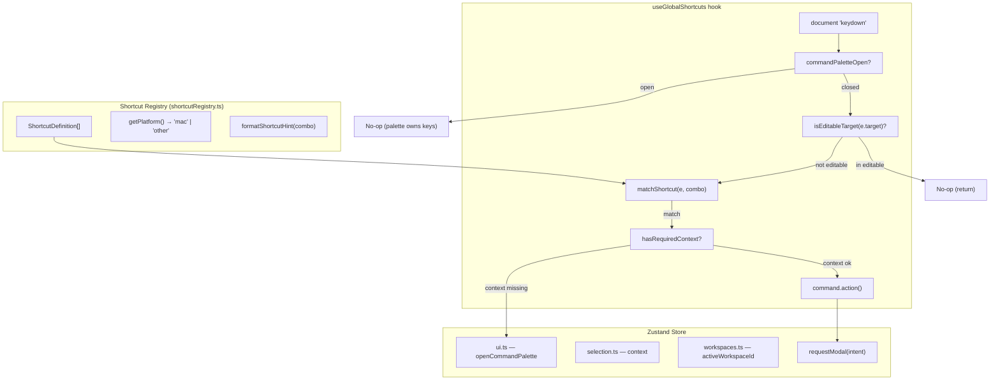

# Global Keyboard Shortcuts for Command Palette

## Problem

The current Command Palette (`src/app/components/command-palette/`) defines `shortcut` strings (e.g. `#R`, `#P`) on commands as display-only hints in `CommandItem.tsx`, but has **no actual keyboard listener** to execute them. The `#R` shortcut notation implicitly maps to Cmd+Shift+R, which is the browser's hard-reload shortcut -- hence the reported bug. Additionally, many common actions (create workspace/team, invite member, rename) lack palette commands entirely.

## Architecture



## Key Decisions

- **Modifier**: `Cmd+Shift` (macOS) / `Ctrl+Shift` (Windows/Linux) -- the `#` prefix in shortcut strings
- **Execution**: Direct dispatch when context is available; open palette when context is missing
- **Conflict resolution**: `e.preventDefault()` on matched shortcuts suppresses browser defaults (including Cmd+Shift+R hard reload)
- **Focus guard**: Skip shortcuts when `e.target` is `INPUT`, `TEXTAREA`, or `contentEditable`
- **Palette-open guard**: When command palette is open, global shortcuts are suppressed (palette has its own key handling via cmdk)
- **No external library**: Lightweight custom hook using native `KeyboardEvent`
- **Auto-focus**: All modals opened by shortcuts auto-focus their primary input; post-create flows select the new entity in the store

## Browser/OS Conflict Analysis

Combos that MUST be avoided (browser/OS will intercept before `preventDefault` can fire, or the override would be too disorienting):

- `Cmd+Shift+N` -- New incognito/private window
- `Cmd+Shift+T` -- Reopen closed tab
- `Cmd+Shift+W` -- Close window (Chrome/Safari)
- `Cmd+Shift+I` -- DevTools
- `Cmd+Shift+J` -- Downloads / Console
- `Cmd+Shift+D` -- Bookmark all tabs
- `Cmd+Shift+B` -- Toggle bookmarks bar
- `Cmd+Shift+C` -- Inspect element
- `Cmd+Shift+V` -- Paste without formatting
- `Cmd+Shift+X` -- Extensions
- `Cmd+Shift+Z` -- Redo

Combos that are SAFE to override (no standard browser binding in regular browsing context, or rarely used and overridable):

- `Cmd+Shift+P` -- Only DevTools palette (not fired in page context)
- `Cmd+Shift+R` -- Hard reload: overridable via `preventDefault` on page keydown; acceptable in production SPA
- `Cmd+Shift+A` -- No standard binding
- `Cmd+Shift+E` -- No standard binding (Firefox sidebar, overridable)
- `Cmd+Shift+F` -- No standard binding in most browsers
- `Cmd+Shift+G` -- Find previous (overridable)
- `Cmd+Shift+K` -- No standard binding
- `Cmd+Shift+L` -- No standard binding
- `Cmd+Shift+S` -- No standard binding
- `Cmd+Shift+U` -- View source (overridable)
- `Cmd+Shift+Y` -- No standard binding

## Shortcut Assignments

### Create Actions

| Action | Shortcut | Key | Context Required | Notes |
|--------|----------|-----|------------------|-------|
| New Workspace | `#K` | K | None | Safe; rare action, mnemonic: worKspace |
| New Team | `#Y` | Y | activeWorkspaceId | Safe; avoids T (reopen tab conflict) |
| New Project | `#P` | P | activeWorkspaceId | Safe |
| New Requirement | `#R` | R | selectedProjectId | Overrides hard reload (acceptable in prod) |
| New Question | `#F` | F | selectedReqId | Safe; mnemonic: ask/query (Q conflicts on some OS) |
| New Answer | `#A` | A | selectedQuestionId | Safe |

### Edit/Manage Actions

| Action | Shortcut | Key | Context Required | Notes |
|--------|----------|-----|------------------|-------|
| Invite Member | `#U` | U | activeWorkspaceId | Safe; mnemonic: User |
| Rename (context) | `#E` | E | any selected entity | Safe; renames whichever entity is "most specific" in current selection |

### Integration Actions (existing, unchanged)

| Action | Shortcut | Key | Context Required | Notes |
|--------|----------|-----|------------------|-------|
| GitHub (connect/disconnect) | `#G` | G | None | Safe |
| Linear (connect/disconnect) | `#L` | L | None | Safe |
| Slack (connect/disconnect) | `#S` | S | None | Safe |

### System (pre-existing)

| Action | Shortcut | Key | Notes |
|--------|----------|-----|-------|
| Open Command Palette | Cmd+K / Ctrl+K | K | Already implemented, no changes |

## Rename Context Resolution

When `#E` (Rename) is triggered, the action targets the **most specific** currently selected entity:

1. If `selectedQuestionId` is set -> rename question (future: inline edit)
2. If `selectedReqId` is set -> rename requirement
3. If `selectedProjectId` is set -> rename project
4. If only `activeWorkspaceId` is set -> open workspace settings (rename there)
5. If nothing is selected -> open palette (fallback)

This uses a priority chain checked in order. The `ModalIntent` will carry `data` with the entity type and ID.

## Auto-Focus Behavior

Every modal opened by a shortcut must:

1. **Auto-focus the primary text input** on open (most modals already do this via `useEffect` + `inputRef.focus()`)
2. **After successful creation**, the new entity should be auto-selected in the store:
   - New project -> `setSelectedProjectId(newId)`
   - New requirement -> `selectRequirement(newId)`
   - New question -> `selectQuestion(newId)`
   - New workspace -> `setActiveWorkspace(newId)` + navigate
   - New team -> already handled by sidebar refresh

Existing modals (`NewProjectModal`, `NewRequirementModal`, etc.) already auto-focus. The new modals (`CreateWorkspaceModal`, `CreateTeamModal`, `InviteMemberModal`) also already have auto-focus via their respective `useEffect` + `inputRef`. Post-create selection needs verification per modal.

## File Changes

### New Files

1. **`src/app/lib/platform.ts`** -- Platform detection utility
   - `getPlatform(): 'mac' | 'other'` using `navigator.userAgentData?.platform ?? navigator.platform`
   - `isMac(): boolean` convenience
   - `formatShortcutHint(shortcut: string): string[]` -- converts `#R` to `['Cmd', 'Shift', 'R']` or `['Ctrl', 'Shift', 'R']`

2. **`src/app/components/command-palette/useGlobalShortcuts.ts`** -- Core hook
   - Single `useEffect` with document keydown listener
   - Reads current commands from `useCommands()` for the command list
   - Guard: early-return if `commandPaletteOpen` is true
   - Guard: early-return if `isEditableTarget(e.target)`
   - Matches key combos against commands that have a `shortcut` field
   - Calls `e.preventDefault()` + `e.stopPropagation()` on match
   - Checks context availability via `contextRequired`; dispatches `openCommandPalette()` when context missing
   - Debug-level logging via `logger.create('shortcuts')`

3. **`src/app/components/command-palette/useGlobalShortcuts.test.ts`** -- Comprehensive tests

4. **`src/app/lib/platform.test.ts`** -- Unit tests for platform detection and hint formatting

### Modified Files

5. **`src/app/store/slices/ui.ts`** -- Expand `ModalIntent` union:
   ```
   | 'createWorkspace'
   | 'createTeam'
   | 'inviteMember'
   | 'renameEntity'
   ```
   The `PendingModal.data` field carries context (e.g. `{ entityType: 'project', entityId: '...' }` for rename).

6. **`src/app/components/command-palette/types.ts`**
   - Add optional `contextRequired` field to `PaletteCommand`:
     ```typescript
     contextRequired?: ('selectedProjectId' | 'selectedReqId' | 'selectedQuestionId' | 'activeWorkspaceId')[];
     ```

7. **`src/app/components/command-palette/useCommands.ts`**
   - Add new commands: `create-workspace`, `create-team`, `invite-member`, `rename-entity`
   - Add `contextRequired` to all existing and new commands
   - Change `#Q` shortcut on "New Question" to `#F`
   - Import new icons (`Users`, `Building`, `Pencil`, `UserPlus`)

8. **`src/app/components/command-palette/CommandPalette.tsx`**
   - Add `useGlobalShortcuts()` call
   - Extract `isEditableTarget` to importable utility (used by both palette toggle and global shortcuts)

9. **`src/app/components/command-palette/CommandItem.tsx`**
   - Replace raw `command.shortcut` kbd display with `formatShortcutHint()` for platform-aware rendering
   - Render each key part as a separate `<kbd>` element with gap between them

10. **`src/app/components/hooks/useSidebarModals.tsx`** -- Wire new `pendingModal` intents
    - Add `useEffect` watching `pendingModal` for `createWorkspace`, `createTeam`, `inviteMember`, `renameEntity`
    - Dispatch to appropriate local state setters (e.g. `setIsCreateWsOpen(true)`)

## Implementation Details

### Platform Detection (`src/app/lib/platform.ts`)

```typescript
export function getPlatform(): 'mac' | 'other' {
  if (typeof navigator === 'undefined') return 'other';
  const platform = navigator.userAgentData?.platform ?? navigator.platform ?? '';
  return /mac/i.test(platform) ? 'mac' : 'other';
}

export function isMac(): boolean {
  return getPlatform() === 'mac';
}

export function formatShortcutHint(shortcut: string): string[] {
  const mac = isMac();
  if (shortcut.startsWith('#')) {
    return [
      mac ? '\u2318' : 'Ctrl',
      mac ? '\u21E7' : 'Shift',
      shortcut.slice(1).toUpperCase(),
    ];
  }
  return [shortcut];
}
```

### Shortcut Matching Logic

```typescript
function matchesShortcut(e: KeyboardEvent, shortcut: string): boolean {
  if (!shortcut.startsWith('#')) return false;
  const key = shortcut.slice(1).toLowerCase();
  const modifierActive = isMac() ? e.metaKey : e.ctrlKey;
  return modifierActive && e.shiftKey && e.key.toLowerCase() === key && !e.altKey;
}
```

### Context Check

```typescript
type ContextKey = 'selectedProjectId' | 'selectedReqId' | 'selectedQuestionId' | 'activeWorkspaceId';

function hasContext(contextRequired: ContextKey[] | undefined, state: AppState): boolean {
  if (!contextRequired?.length) return true;
  return contextRequired.every(key => state[key] != null);
}
```

### New Commands in `useCommands.ts`

```typescript
commands.push({
  id: 'create-workspace',
  label: 'New Workspace',
  icon: Building,
  category: 'Create',
  keywords: ['create', 'workspace', 'new', 'organization'],
  shortcut: '#K',
  contextRequired: [],
  action: () => requestModal('createWorkspace'),
});

commands.push({
  id: 'create-team',
  label: 'New Team',
  icon: Users,
  category: 'Create',
  keywords: ['create', 'team', 'new', 'group'],
  shortcut: '#Y',
  contextRequired: ['activeWorkspaceId'],
  action: () => requestModal('createTeam'),
});

commands.push({
  id: 'invite-member',
  label: 'Invite Member',
  icon: UserPlus,
  category: 'Create',
  keywords: ['invite', 'member', 'user', 'add', 'collaborate'],
  shortcut: '#U',
  contextRequired: ['activeWorkspaceId'],
  action: () => requestModal('inviteMember'),
});

commands.push({
  id: 'rename-entity',
  label: 'Rename...',
  icon: Pencil,
  category: 'Edit',
  keywords: ['rename', 'edit', 'name', 'change'],
  shortcut: '#E',
  contextRequired: [],
  action: () => {
    // Resolve most specific selected entity
    const state = useStore.getState();
    const entityType = state.selectedQuestionId ? 'question'
      : state.selectedReqId ? 'requirement'
      : state.selectedProjectId ? 'project'
      : 'workspace';
    const entityId = state.selectedQuestionId
      ?? state.selectedReqId
      ?? state.selectedProjectId
      ?? state.activeWorkspaceId;
    if (!entityId) { openCommandPalette(); return; }
    requestModal('renameEntity', { entityType, entityId });
  },
});
```

### Category Update

Add `'Edit'` to the `CommandCategory` type and `CATEGORY_ORDER` array in `CommandPalette.tsx`:

```typescript
export type CommandCategory = 'Create' | 'Edit' | 'Navigation' | 'Integrations';
const CATEGORY_ORDER: CommandCategory[] = ['Create', 'Edit', 'Navigation', 'Integrations'];
```

### Wiring New Modal Intents in Sidebar

In `useSidebarModals.tsx`, add a `useEffect` that listens to `pendingModal` and opens the correct modal:

```typescript
const pendingModal = useStore(selectPendingModal);
const clearPendingModal = useStore(s => s.clearPendingModal);

useEffect(() => {
  if (!pendingModal) return;
  switch (pendingModal.type) {
    case 'createWorkspace': setIsCreateWsOpen(true); break;
    case 'createTeam': setIsCreateTeamOpen(true); break;
    case 'inviteMember':
      if (activeWorkspace) openInvite('workspace', activeWorkspace.id, activeWorkspace.name);
      break;
    case 'renameEntity': {
      const { entityType, entityId } = pendingModal.data as { entityType: string; entityId: string };
      if (entityType === 'project') {
        const p = projects.find(x => x.id === entityId);
        if (p) openRenameProject(p.id, p.name);
      } else if (entityType === 'team') {
        const t = teams.find(x => x.id === entityId);
        if (t) openRenameTeam(t.id, t.name);
      }
      break;
    }
  }
  clearPendingModal();
}, [pendingModal]);
```

### CommandItem Shortcut Display

Render each key part as a separate `<kbd>` element:

```typescript
import { formatShortcutHint } from '../../lib/platform';

// In the component:
{command.shortcut && (
  <span className="flex items-center gap-0.5 shrink-0">
    {formatShortcutHint(command.shortcut).map((part, i) => (
      <kbd key={i} className="inline-flex items-center justify-center min-w-[20px] px-1 py-0.5 bg-surface-frost-04 border border-border-default rounded-standard text-[11px] font-mono text-text-empty">
        {part}
      </kbd>
    ))}
  </span>
)}
```

## Testing Strategy

Tests in `useGlobalShortcuts.test.ts` using Vitest + Testing Library + `fireEvent.keyDown(document)`:

- **Each shortcut executes correct action** -- e.g. fire `metaKey + shiftKey + key='r'` -> `requestModal('createRequirement')`
- **New shortcuts work** -- `#K` creates workspace, `#Y` creates team, `#U` invites member, `#E` renames
- **Platform detection** -- mock `navigator.platform` as `'Win32'` -> verify `ctrlKey` is required
- **Focus guard** -- create input, focus it, fire shortcut -> verify no action dispatched
- **Palette-open guard** -- set `commandPaletteOpen: true` in store -> fire shortcut -> verify no action
- **Missing context** -- clear `selectedProjectId` -> fire `#R` -> verify `openCommandPalette()` called
- **Rename resolution** -- with `selectedReqId` set, fire `#E` -> verify `requestModal('renameEntity', { entityType: 'requirement', ... })`
- **Conflict prevention** -- verify `preventDefault()` and `stopPropagation()` called on matched events
- **Unregistered combo** -- fire `Cmd+Shift+Z` -> verify no action, no preventDefault
- **All modifiers required** -- fire `Shift+R` without Cmd -> verify no action

Unit tests in `platform.test.ts`:
- `getPlatform()` returns 'mac' for macOS user agents
- `formatShortcutHint('#R')` returns correct platform-specific parts
- `formatShortcutHint` handles non-hash shortcuts gracefully

## Constraints Respected

- **Master Rules**: No hardcoding (shortcuts from command definitions), strong SoC (hook owns keyboard logic, store owns state), SSOT (commands define both display and behavior), explicit state (context requirements declared), debug logging on all shortcut matches/misses
- **Architecture**: Platform util in infrastructure (`lib/`), hook in command-palette module, UI only renders hints, store dispatches via existing `requestModal`
- **Design System**: Kbd elements use `bg-surface-frost-04`, `border-border-default`, `rounded-standard`, `text-[11px] font-mono text-text-empty`; no inline styles; no className passed to base components
- **No inline components**: All new rendering extracted to proper components/utilities; `useGlobalShortcuts` is a hook; shortcut hint rendering uses `formatShortcutHint` utility
- **Scalability**: New shortcuts are added by simply adding a `shortcut` field to any command in `useCommands.ts` -- zero changes needed in the hook itself
