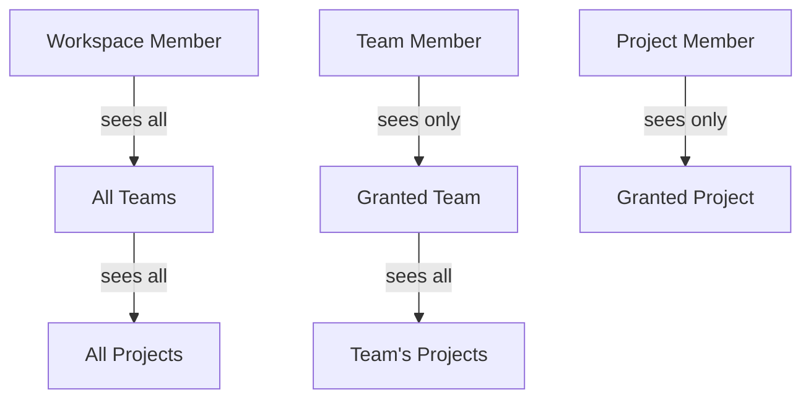

# Hierarchical Access Control (RBAC)

## Access Model

Additive, grant-based with downward cascade:



- **Workspace member** (existing) -- sees all teams and all projects
- **Team member** (new) -- sees only teams they're a member of + those teams' projects
- **Project member** (new) -- sees only specific projects they're granted

Roles cascade: a workspace owner is implicitly owner of all teams and projects. A team admin is implicitly admin of all projects in that team. Explicit lower-level grants can only ADD access, never restrict.

## Current State

Currently only `workspace_memberships` exists. All access checks use `private.user_workspace_ids()` which returns workspaces the user belongs to. Teams and projects are visible to all workspace members without filtering.

## Database Changes

### New tables

**`team_memberships`**:
- `id` uuid PK default `gen_random_uuid()`
- `team_id` uuid FK -> `teams(id)` ON DELETE CASCADE
- `user_id` uuid FK -> `auth.users(id)` ON DELETE CASCADE
- `role` text NOT NULL CHECK (role IN ('admin', 'member'))
- `joined_at` timestamptz DEFAULT now()
- Unique: `(team_id, user_id)`

**`project_memberships`**:
- `id` uuid PK default `gen_random_uuid()`
- `project_id` text FK -> `projects(id)` ON DELETE CASCADE
- `user_id` uuid FK -> `auth.users(id)` ON DELETE CASCADE
- `role` text NOT NULL CHECK (role IN ('admin', 'member'))
- `joined_at` timestamptz DEFAULT now()
- Unique: `(project_id, user_id)`

### Updated private helpers

Replace `private.user_workspace_ids()` with a unified access resolution function. The core question the RLS needs to answer: "can this user see this project?"

**`private.user_accessible_team_ids(p_workspace_id uuid)`** -- returns team IDs the user can access in a workspace:
```sql
-- Teams from workspace membership (all teams)
SELECT t.id FROM teams t
WHERE t.workspace_id = p_workspace_id
AND t.workspace_id IN (SELECT private.user_workspace_ids())
UNION
-- Teams from direct team membership
SELECT tm.team_id FROM team_memberships tm
JOIN teams t ON t.id = tm.team_id
WHERE t.workspace_id = p_workspace_id AND tm.user_id = auth.uid()
```

**`private.user_accessible_project_ids(p_workspace_id uuid)`** -- returns project IDs the user can access:
```sql
-- All projects if workspace member
SELECT p.id FROM projects p
WHERE p.workspace_id = p_workspace_id
AND p.workspace_id IN (SELECT private.user_workspace_ids())
UNION
-- Projects in accessible teams
SELECT p.id FROM projects p
JOIN team_memberships tm ON tm.team_id = p.team_id AND tm.user_id = auth.uid()
WHERE p.workspace_id = p_workspace_id
UNION
-- Direct project grants
SELECT pm.project_id FROM project_memberships pm
JOIN projects p ON p.id = pm.project_id
WHERE p.workspace_id = p_workspace_id AND pm.user_id = auth.uid()
```

**`private.user_effective_role(p_workspace_id uuid, p_team_id uuid, p_project_id uuid)`** -- returns the highest role across all grant levels:
```sql
-- Cascade: workspace role > team role > project role
SELECT role FROM (
  SELECT role, 1 as priority FROM workspace_memberships WHERE workspace_id = p_workspace_id AND user_id = auth.uid()
  UNION ALL
  SELECT role, 2 FROM team_memberships WHERE team_id = p_team_id AND user_id = auth.uid()
  UNION ALL
  SELECT role, 3 FROM project_memberships WHERE project_id = p_project_id AND user_id = auth.uid()
) roles
ORDER BY
  CASE role WHEN 'owner' THEN 1 WHEN 'admin' THEN 2 WHEN 'member' THEN 3 END,
  priority
LIMIT 1
```

### Updated RLS policies

**Teams**: visible if user has workspace membership OR direct team membership:
```sql
USING (
  workspace_id IN (SELECT private.user_workspace_ids())
  OR id IN (SELECT team_id FROM team_memberships WHERE user_id = auth.uid())
)
```

**Projects**: visible if workspace member, team member, or direct project grant:
```sql
USING (
  workspace_id IN (SELECT private.user_workspace_ids())
  OR team_id IN (SELECT team_id FROM team_memberships WHERE user_id = auth.uid())
  OR id IN (SELECT project_id FROM project_memberships WHERE user_id = auth.uid())
  OR user_id = auth.uid()
)
```

Requirements/questions/answers/summaries chain through projects as before.

### RLS on new tables

`team_memberships` and `project_memberships` use the same pattern as `workspace_memberships`: SELECT via private helpers, INSERT/UPDATE/DELETE require admin role at the parent level.

## Invitation Flow Update

The existing `workspace_invitations` table already has `team_id`. Extend it to support all three scope levels.

**Alter** `workspace_invitations`:
- ADD `project_id` text FK -> `projects(id)` ON DELETE CASCADE, nullable
- ADD `scope` text NOT NULL DEFAULT 'workspace' CHECK (scope IN ('workspace', 'team', 'project'))

The `scope` field determines what gets created on accept:
- `scope = 'workspace'` -> creates `workspace_membership` (existing behavior)
- `scope = 'team'` -> creates `team_membership` + `workspace_membership` (if not already a workspace member, adds as limited member)
- `scope = 'project'` -> creates `project_membership` + `workspace_membership` (same limited pattern)

### InviteMemberModal update

Add a scope selector to [src/app/components/InviteMemberModal.tsx](src/app/components/InviteMemberModal.tsx):
- **Workspace** (default) -- invite to entire workspace
- **Team** -- shows team picker, invite to specific team
- **Project** -- shows project picker, invite to specific project

## Schema Changes

**New files**:
- `shared/schemas/teamMembership.ts` -- Row/Domain/Create schemas
- `shared/schemas/projectMembership.ts` -- Row/Domain/Create schemas

**Updated**:
- `shared/schemas/invitation.ts` -- add `project_id`, `scope` fields
- `shared/schemas/index.ts` -- re-export new schemas

## Server Routes

**New file** `server/routes/teamMemberships.ts`:
- `GET /?team_id=` -- list team members
- `POST /` -- add team member
- `DELETE /:id` -- remove team member

**New file** `server/routes/projectMemberships.ts`:
- `GET /?project_id=` -- list project members
- `POST /` -- add project member
- `DELETE /:id` -- remove project member

**Updated** `server/routes/invitations.ts`:
- POST accepts `scope`, `team_id`, `project_id`
- Accept flow creates the appropriate membership type based on `scope`

## Frontend: Filtering

**Updated** [src/app/store/slices/workspaces.ts](src/app/store/slices/workspaces.ts):
- Teams are already filtered by the API (RLS handles it). Team-level members only see their teams.
- Projects are already filtered by the API. Project-level members only see their projects.
- No frontend filtering logic needed -- RLS does it all at the database level.

**Updated** Sidebar: already renders what the store provides. If RLS filters teams/projects, the sidebar automatically shows only accessible ones.

## Domain Logic

**New file** [src/app/domain/access.ts](src/app/domain/access.ts):
- `getEffectiveRole(workspaceRole, teamRole, projectRole)` -- returns highest role
- `canManageAtLevel(role, level)` -- checks if role allows management at given scope

## Files Summary

**Database (1 migration)**:
- Create `team_memberships`, `project_memberships` tables
- Add `scope`, `project_id` to `workspace_invitations`
- New/updated private helper functions
- Updated RLS policies on teams, projects, and child tables

**New files (4)**:
- `shared/schemas/teamMembership.ts`
- `shared/schemas/projectMembership.ts`
- `server/routes/teamMemberships.ts`
- `server/routes/projectMemberships.ts`
- `src/app/domain/access.ts`

**Updated files (6)**:
- `shared/schemas/invitation.ts` -- add scope, project_id
- `shared/schemas/index.ts` -- re-export
- `server/routes/invitations.ts` -- scope-aware accept
- `server/index.ts` -- mount new routes
- `src/app/components/InviteMemberModal.tsx` -- scope selector
- `src/app/components/WorkspaceSettingsModal.tsx` -- show team/project member counts

## Key Design Decision: RLS Does the Heavy Lifting

The beauty of this approach: the frontend doesn't need to filter anything. The API returns only what the user is allowed to see, enforced at the database level. A team-level member calls `GET /teams?workspace_id=X` and only gets their teams back. They call `GET /projects?workspace_id=X` and only get their teams' projects back. The Sidebar renders whatever it receives. No client-side access checking needed for visibility.

Role-based UI controls (can this user create/edit/delete) still use the domain helpers, but visibility is entirely RLS-driven.
