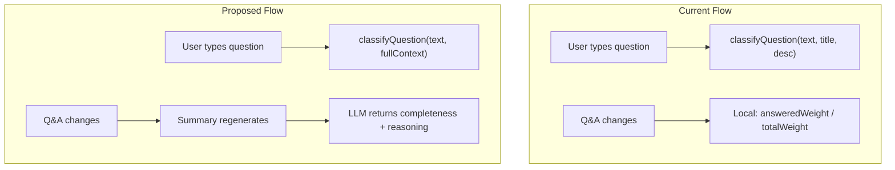

# Intelligent Completeness Engine

## Problem

1. **Classification is context-starved**: `classifyQuestion` only sees the question text + requirement title/description. It has no awareness of the project, sibling requirements, or existing Q&A coverage.
2. **Completeness is mechanical**: A weighted answered/total ratio that punishes users for having unanswered Optional questions. It cannot reason about whether enough information actually exists to implement.

## Design

---

## Part 1: Enhanced Question Classification

**File:** [server/openrouter.ts](server/openrouter.ts)

Currently `classifyQuestion` receives only `questionText`, `requirementTitle`, `requirementDescription`. We will pass the full requirement context (reusing `fetchRequirementContext`) so the LLM can reason about:

- What the project is about (project name, sibling requirements)
- What has already been asked and answered (existing Q&A tree)
- Which coverage dimensions are already well-covered vs. lacking

**Changes:**

1. **[server/routes/questions.ts](server/routes/questions.ts)** — `/classify` endpoint: replace the minimal DB lookup with `fetchRequirementContext(db, requirementId)` and pass the full context to the classification function.

2. **[server/openrouter.ts](server/openrouter.ts)** — `classifyQuestion` signature and prompt:
   - Accept the full `RequirementFullContext` (or a subset) instead of just title/description
   - Rewrite the system prompt to include reasoning guidelines:
     - "Critical" = without this answer, an engineer would have to guess or make dangerous assumptions
     - "Important" = affects architecture or quality, but a reasonable default can be assumed
     - "Optional" = refines understanding, implementation can safely proceed without it
   - Include the existing Q&A in the user message so the LLM can see what's already covered (a question about scope is less critical if scope is already well-defined by other answers)

---

## Part 2: LLM-Based Completeness via Summary Generation

**Core idea:** Add a `completeness` score (0-100) and a `completeness_reasoning` string to the summary response. The LLM already sees the full Q&A tree during summary generation — it simply also produces a holistic judgment of implementation readiness.

**Personality directive ("nice guy"):** The prompt will instruct the LLM that:
- 100% means "an engineer can confidently implement this without guessing on any critical decision"
- It does NOT mean every conceivable question is answered
- Optional questions being unanswered should NOT prevent reaching 100%
- If the requirement description is rich enough, fewer questions may be needed
- Bias toward achievability — when in doubt, round up

**Changes:**

3. **[shared/schemas/summary.ts](shared/schemas/summary.ts)** — Add `completeness` (number 0-100) and `completeness_reasoning` (string) to `GenerateSummaryResponseSchema`.

4. **[server/openrouter.ts](server/openrouter.ts)** — Update `buildSystemPrompt()` to request the two new fields, with the "forgiving" personality directives described above.

5. **Database migration** — Add `completeness` (integer) and `completeness_reasoning` (text) columns to the `summaries` table.

6. **[server/routes/summaries.ts](server/routes/summaries.ts)** — Persist the new fields in the upsert.

7. **[src/app/components/SummaryColumn.tsx](src/app/components/SummaryColumn.tsx)** — Replace the local `calculatedCompleteness` with `summary.completeness` when a summary exists. Fall back to the mechanical calculation only when no summary has been generated yet (initial state before first auto-generation).

8. **[src/app/components/summary/KnowledgeCompleteness.tsx](src/app/components/summary/KnowledgeCompleteness.tsx)** — Optionally display `completeness_reasoning` as a tooltip or subtitle so the user understands why Arvid gave that score.

---

## Behavioral Contract

| Scenario | Expected Completeness |
|---|---|
| No questions exist yet | Low (LLM recognizes nothing is validated) |
| All Critical questions answered, Optional unanswered | ~90-100% (implementation can proceed) |
| Rich requirement description, few questions needed | High even with few questions |
| Conflicting answers on Critical questions | Drops significantly |
| All questions answered with clear answers | 100% |

---

## Files Touched

| File | Change |
|---|---|
| `server/routes/questions.ts` | `/classify` uses full context |
| `server/openrouter.ts` | Enhanced `classifyQuestion` + summary prompt adds completeness |
| `shared/schemas/summary.ts` | Schema adds `completeness` + `completeness_reasoning` |
| `server/routes/summaries.ts` | Persist new fields |
| `src/app/components/SummaryColumn.tsx` | Use LLM completeness from summary |
| `src/app/components/summary/KnowledgeCompleteness.tsx` | Show reasoning |
| Supabase migration | Add columns to `summaries` table |
