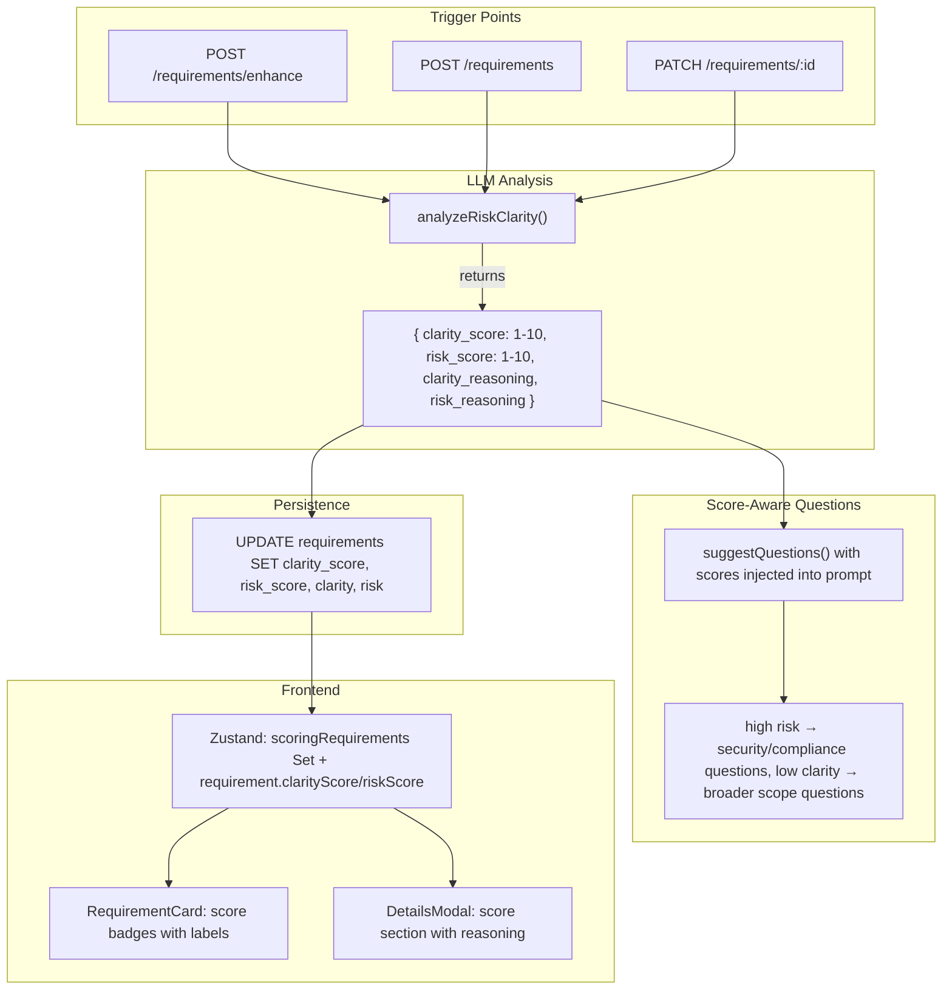

# LLM-Driven Requirement Risk and Clarity Enhancement

## Current State

Risk and clarity are stored as **enum strings** (`'Low' | 'Medium' | 'High'`) in the `requirements` table, set statically at creation time (`clarity: 'Low'`, `risk: 'Medium'`). The UI displays them as colored indicator dots in `RequirementCard` footer. Question suggestion (`suggestQuestions` in [server/openrouter.ts](server/openrouter.ts)) is score-unaware -- it does not factor risk/clarity into question prioritization.

## Architecture



## 1. Database Migration

**File:** New `supabase/migrations/YYYYMMDDHHMMSS_add_risk_clarity_scores.sql`

Add numeric score columns alongside existing enum columns (backward-compatible):

- `clarity_score SMALLINT CHECK (clarity_score BETWEEN 1 AND 10)` -- nullable initially
- `risk_score SMALLINT CHECK (risk_score BETWEEN 1 AND 10)` -- nullable initially
- `clarity_reasoning TEXT` -- LLM explanation of clarity score
- `risk_reasoning TEXT` -- LLM explanation of risk score
- `scores_computed_at TIMESTAMPTZ` -- when LLM last scored

Keep existing `clarity` and `risk` enum columns. They will be **derived from scores** when scores exist (1-3 = Low, 4-6 = Medium, 7-10 = High), maintaining backward compatibility with all existing code that reads the enum.

## 2. Shared Schema Changes

**File:** [shared/schemas/enums.ts](shared/schemas/enums.ts) -- no changes needed (keep enums)

**File:** [shared/schemas/requirement.ts](shared/schemas/requirement.ts)

- Add to `RequirementRowSchema`: `clarity_score`, `risk_score`, `clarity_reasoning`, `risk_reasoning`, `scores_computed_at` (all nullable/optional)
- Add to `RequirementSchema` transform: `clarityScore`, `riskScore`, `clarityReasoning`, `riskReasoning`, `scoresComputedAt`
- Add `UpdateRequirementBodySchema` fields

**File:** New `shared/schemas/riskClarity.ts`

- `RiskClarityResponseSchema` (Zod): validates LLM JSON output shape
- `ScoreLabel` type: maps numeric 1-10 to `'Low' | 'Medium' | 'High'`
- `scoreToClarityLabel(score: number)` and `scoreToRiskLabel(score: number)` pure functions
- Thresholds: 1-3 = Low, 4-6 = Medium, 7-10 = High

## 3. Server: LLM Analysis Function

**File:** [server/openrouter.ts](server/openrouter.ts) -- add `analyzeRiskClarity()`

New function following the existing pattern (same model, same error handling, JSON response format):

```typescript
interface RiskClarityInput {
  title: string;
  description?: string;
}

interface RiskClarityResult {
  clarity_score: number;    // 1-10
  risk_score: number;       // 1-10
  clarity_reasoning: string;
  risk_reasoning: string;
}
```

**System prompt** instructs Arvid to:
- Analyze ONLY the raw requirement text (per constraint: no full project context)
- Score **clarity** (1-10) based on: ambiguity in language, specificity of acceptance criteria, completeness of inputs/outputs/constraints, precision of terminology
- Score **risk** (1-10) based on: security/compliance implications, integration complexity, external dependency count, data sensitivity, performance/scalability unknowns, deployment risk
- Provide 1-2 sentence reasoning for each score
- Output JSON with `clarity_score`, `risk_score`, `clarity_reasoning`, `risk_reasoning`

Temperature: 0.2 (deterministic). Validation via Zod schema. Clamp scores to 1-10 post-parse.

## 4. Server: Integration into Requirement Lifecycle

**File:** [server/routes/requirements.ts](server/routes/requirements.ts)

Three trigger points (all fire-and-forget, non-blocking):

**A. After enhance** (`POST /requirements/enhance`): After the existing `enhanceRequirement()` call returns the title+description, fire `analyzeRiskClarity()` in parallel. Return scores alongside the enhanced text in the response. New response shape: `{ title, description, clarityScore?, riskScore?, clarityReasoning?, riskReasoning? }`.

**B. After create** (`POST /requirements`): Fire `analyzeRiskClarity()` as a background task (non-blocking, same pattern as `persistFigmaLinks`). Update the requirement row with scores when complete.

**C. After update** (`PATCH /requirements/:id`): If `title` or `description` changed, fire background re-scoring. Update the row.

In all cases, derive the enum value from the score (`scoreToClarityLabel` / `scoreToRiskLabel`) and write both the numeric score and the enum to the DB in one update.

**Fallback:** If `analyzeRiskClarity()` throws, log the error and leave scores as `null`. The existing static enum defaults (`clarity: 'Low'`, `risk: 'Medium'`) remain untouched. The UI falls back to displaying the enum when scores are absent.

## 5. Server: Score-Aware Question Suggestion

**File:** [server/openrouter.ts](server/openrouter.ts) -- modify `suggestQuestions()`

Extend `SuggestQuestionsInput` with optional `clarityScore?: number` and `riskScore?: number`.

Add a new block to the system prompt (injected conditionally when scores are present):

```
## Score-Aware Prioritization
This requirement has been scored:
- Clarity: {clarityScore}/10 ({label}) — {reasoning}
- Risk: {riskScore}/10 ({label}) — {reasoning}

Adapt your questions accordingly:
- If risk is high (>=7): Prioritize questions about security, compliance, integration risks, data sensitivity, and failure modes.
- If clarity is low (<=3): Ask broader scoping and definition questions to establish fundamentals.
- If both scores are moderate (4-6): Balance across all dimensions.
- If clarity is high and risk is low: Coverage may already be good — consider returning fewer or no questions.
```

**File:** [server/routes/questions.ts](server/routes/questions.ts) (or wherever `suggestQuestions` endpoint lives) -- pass scores from the requirement row into the LLM input.

## 6. Frontend: Types and API

**File:** [src/app/types.ts](src/app/types.ts) -- new types auto-exported from shared schemas (`clarityScore`, `riskScore`, etc.)

**File:** [src/app/api.ts](src/app/api.ts)

- Update `enhanceRequirement` return type to include optional scores
- No new API endpoints needed; scores arrive via existing requirement CRUD responses

## 7. Frontend: Store

**File:** [src/app/store/slices/entities.ts](src/app/store/slices/entities.ts)

- Add `scoringRequirements: Set<string>` to track which requirements are being scored
- Update `enhanceRequirement` action: if response includes scores, store them in a transient state (passed to `createRequirement`)
- Update `createRequirement`: include scores in the API payload if available from enhance step
- After `createRequirement`, if no scores yet, the background server task will compute them; poll or rely on next `refreshRequirements` to pick them up
- Add `updateRequirement`: on title/description change, set `scoringRequirements` for loading state, clear on next refresh

## 8. Frontend: UI Components

### RequirementCard ([src/app/components/RequirementCard.tsx](src/app/components/RequirementCard.tsx))

Replace the two indicator dots in `Card.Footer` with score-aware display:
- If `clarityScore` exists: show `C:{score}` badge with color (green 7-10, amber 4-6, red 1-3)
- If `riskScore` exists: show `R:{score}` badge with inverted color (green 1-3, amber 4-6, red 7-10)
- If scores are null (not yet computed or fallback): keep existing colored dots with enum labels
- If scoring in progress: show subtle pulse animation on the indicator area

### DetailsModal ([src/app/components/DetailsModal.tsx](src/app/components/DetailsModal.tsx))

Add a "Risk & Clarity" section to the Details tab (below existing Properties):
- Two horizontal bars or gauges showing clarity (1-10) and risk (1-10) with labels
- Reasoning text below each score in `text-caption-lg text-text-tertiary`
- If scores not computed: show "Not yet analyzed" with option to trigger analysis
- Loading skeleton while scoring is in progress

### EnhanceStep ([src/app/components/requirement/EnhanceStep.tsx](src/app/components/requirement/EnhanceStep.tsx))

After enhancement completes, if scores are returned:
- Show a small "Analysis" section below the description field
- Display clarity and risk scores with labels and reasoning
- Purely informational, not editable

## 9. Edge Cases (per spec constraints)

| Scenario | Behavior |
|---|---|
| Empty/very short text (<10 chars) | Skip LLM call, keep static defaults, show original placeholders |
| LLM failure (timeout/500/parse error) | Log error, keep `null` scores, UI falls back to enum dots |
| Neutral scores (both 4-6) | Questions are balanced across all dimensions |
| Rapid title/description edits | Debounce re-scoring (only fire after 2s of no changes on PATCH) |
| Scores already computed, text unchanged | Skip re-scoring (compare content hash or `scores_computed_at` vs `updated_at`) |

## Key Files Changed

| File | Change |
|---|---|
| `supabase/migrations/new.sql` | Add score columns |
| `shared/schemas/requirement.ts` | Add score fields to schema |
| `shared/schemas/riskClarity.ts` | New: Zod schema, score-to-label utils |
| `shared/schemas/index.ts` | Export new schema |
| `server/openrouter.ts` | Add `analyzeRiskClarity()`, modify `suggestQuestions()` prompt |
| `server/routes/requirements.ts` | Trigger scoring at enhance/create/update |
| `src/app/store/slices/entities.ts` | Add `scoringRequirements`, wire scores through actions |
| `src/app/components/RequirementCard.tsx` | Score badges replacing indicator dots |
| `src/app/components/DetailsModal.tsx` | Risk/Clarity section with reasoning |
| `src/app/components/requirement/EnhanceStep.tsx` | Show scores after enhancement |

## Risks and Open Questions

- **Prompt tuning**: The exact prompt for `analyzeRiskClarity()` will need iteration. Initial implementation should be conservative (bias toward medium scores), then calibrate based on real-world output.
- **Score thresholds for question adaptation**: Starting with 1-3/4-6/7-10 bands. May need finer granularity (e.g., >=8 for "very high risk" special handling).
- **Cost**: One additional LLM call per requirement create/update. Using the same `grok-4.1-fast` model. Short prompt (~500 tokens input, ~200 tokens output). Estimated $0.001 per scoring call. Negligible.
- **Latency**: `analyzeRiskClarity()` runs in ~1-2s. For enhance, it runs in parallel with the response. For create/update, it's fire-and-forget background.
- **Question generation timing**: After create, questions are suggested before scores arrive (background). Could delay question suggestion until scores are available, or re-suggest once scores arrive. Recommendation: suggest immediately with existing prompt, then don't re-trigger just for scores (scores will influence next round of suggestions).
