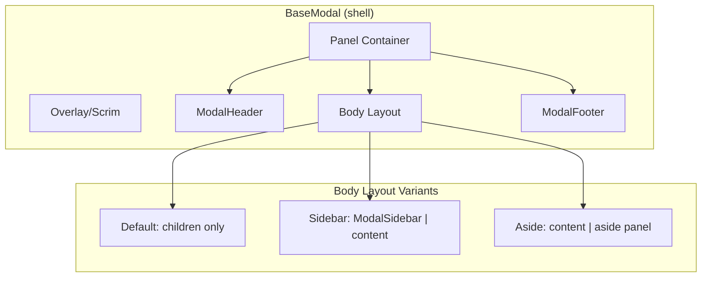

# Modal System Refactor

## Current State

`BaseModal` in [src/app/components/BaseModal.tsx](src/app/components/BaseModal.tsx) is a single monolithic component that handles overlay, panel, header, body layout, aside column, and footer. It has token mismatches (`border-border-subtle` instead of `border-border-strong`), a loose `aside` prop that produces equal-width columns, and no concept of a tabbed sidebar navigation. Consumer modals duplicate sidebar nav, footer layouts, arbitrary typography, raw inputs, inline render helpers, and inline styles.

## Target Architecture

Decompose the modal into composable primitives matching the three Figma components (Modal Header, Modal Sidebar, Modal Footer) while keeping `BaseModal` as the single entry point. Consumers pass typed props; the base owns all visual styling.



## Figma-to-Token Mapping

From the three Figma primitives:

- **Panel**: `bg-surface-panel`, `border border-border-strong`, `rounded-panel`, `shadow-modal`
- **Header**: `p-6`, title `text-caption-lg text-text-primary`, close icon `ICON_SIZE.md`, no bottom border (Figma shows no divider, border comes from panel edge)
- **Sidebar**: `p-6`, `gap-4` between items, right border `border-r border-border-strong`, items use `text-caption-lg` with regular weight for default and medium weight for active, icon `ICON_SIZE.md`
- **Footer**: `p-6`, `rounded-b-panel`, layout `justify-between`, buttons use `btn-ghost` (bordered Back) and `btn-primary`
- **Overlay**: `bg-overlay-scrim` (already correct)

## Size Variant System

| Variant | Width | Height | Use Case |
|---------|-------|--------|----------|
| `sm` | `max-w-modal-sm` (400px) | auto, max 85vh | Confirmations, deletes, renames, link pickers |
| `md` | `max-w-modal-md` (480px) | auto, max 85vh | Single-field forms (new project, invite) |
| `lg` | `max-w-modal-lg` (520px) | auto, max 85vh | Multi-field forms, multi-step |
| `wide` | `max-w-modal-wide` (760px) | auto, max 85vh | Content-rich (impl details with aside) |
| `xl` | 80vw | 80vh | Complex tabbed modals with sidebar |

The `xl` variant switches to viewport-relative sizing. A new token pair `--modal-width-xl-vw: 80vw` and `--modal-height-xl-vh: 80vh` will be added to [src/styles/theme.css](src/styles/theme.css), but since Tailwind arbitrary values for `vw`/`vh` are layout constraints (not visual tokens like colors/shadows), using `w-[80vw] h-[80vh]` in the base component is acceptable per the design system's exception for component sizing.

## New Primitives (all in `src/app/components/ui/`)

### 1. ModalHeader (`src/app/components/ui/ModalHeader.tsx`)

Extracted from BaseModal. Owns all header styling.

```tsx
interface ModalHeaderProps {
  title: string;
  onClose: () => void;
}
```

Styling: `flex items-center justify-between p-6 shrink-0`, title `text-caption-lg text-text-primary`, close button same ghost pattern as current.

### 2. ModalSidebar (`src/app/components/ui/ModalSidebar.tsx`)

New component for tabbed sidebar navigation in `xl` modals.

```tsx
interface ModalSidebarItem {
  id: string;
  label: string;
  icon: React.ReactNode;
}

interface ModalSidebarProps {
  items: ModalSidebarItem[];
  activeId: string;
  onSelect: (id: string) => void;
}
```

Styling per Figma: `w-[200px] shrink-0 border-r border-border-strong p-6 flex flex-col gap-1`, items `flex items-center gap-2 px-3 py-2 rounded-comfortable text-caption-lg transition-colors`, active `bg-surface-frost-08 text-text-primary`, inactive `text-text-tertiary hover:bg-surface-frost-04 hover:text-text-secondary`.

This replaces the duplicated sidebar nav in `DetailsModal`, `WorkspaceSettingsModal`, and `AccountSettingsModal`.

### 3. ModalFooter (`src/app/components/ui/ModalFooter.tsx`)

Typed footer matching Figma layout.

```tsx
interface ModalFooterProps {
  back?: React.ReactNode;
  children: React.ReactNode;
}
```

Styling: `flex items-center justify-between gap-3 p-6 shrink-0`. `back` renders on the left, `children` on the right in a `flex items-center gap-3` wrapper. When no `back`, the left side is empty (justify-between pushes children right).

This is intentionally a layout-only component that accepts ReactNode for flexibility (some modals use `SubmitButton`, some use plain `btn-primary`, some need loading states). The footer owns the container styling; consumers provide the buttons using existing `btn-*` classes.

## BaseModal Changes

The refactored [src/app/components/BaseModal.tsx](src/app/components/BaseModal.tsx) becomes:

**Props:**
```tsx
interface BaseModalProps {
  isOpen: boolean;
  onClose: () => void;
  title: string;
  size?: ModalSize;        // 'sm' | 'md' | 'lg' | 'wide' | 'xl'
  sidebar?: React.ReactNode;  // replaces `aside` for sidebar layout
  aside?: React.ReactNode;    // keep for side-panel layout (ImplDetailsModal)
  footer?: React.ReactNode;
  children: React.ReactNode;
}
```

**Token fixes in the panel:**
- `border-border-subtle` --> `border-border-strong` (panel and any internal borders)
- `max-h-[85vh]` --> keep as-is (layout constraint, not a visual token)

**Body layout logic:**
- If `sidebar` is provided: render `ModalSidebar | scrollable content` (used by xl modals)
- If `aside` is provided: render `content | aside panel` with proper proportions
- Otherwise: render children directly with `p-6` padding

**xl variant:**
- Panel: `w-[80vw] h-[80vh]` instead of `max-w-modal-xl max-h-[85vh]`
- Body fills remaining space with `flex-1 min-h-0`
- No outer `p-6` on the body (sidebar/content own their padding)

**Header/Footer:** Rendered via `ModalHeader` and `ModalFooter` internally. Consumers don't need to import these directly for basic use, but can use `ModalFooter` for typed footer content.

## Consumer Modal Migration

### Group 1: Already Clean (no changes needed to content)
- [RenameProjectModal.tsx](src/app/components/RenameProjectModal.tsx)
- [RenameTeamModal.tsx](src/app/components/RenameTeamModal.tsx)
- [CreateTeamModal.tsx](src/app/components/CreateTeamModal.tsx)
- [CreateWorkspaceModal.tsx](src/app/components/CreateWorkspaceModal.tsx)
- [NewProjectModal.tsx](src/app/components/NewProjectModal.tsx)

These only need footer wrapped in `ModalFooter` and `font-[var(--fw-medium)]` spans replaced with `text-caption-lg` or appropriate preset.

### Group 2: Simple modals with minor fixes
- [DeleteProjectModal.tsx](src/app/components/DeleteProjectModal.tsx) -- `font-[var(--fw-medium)]` on emphasis span
- [DeactivateModal.tsx](src/app/components/DeactivateModal.tsx) -- `font-[var(--fw-semibold)]`
- [ChangeIntegrationModal.tsx](src/app/components/ChangeIntegrationModal.tsx) -- `font-[var(--fw-semibold)]`
- [NewAnswerModal.tsx](src/app/components/NewAnswerModal.tsx) -- `font-[var(--fw-medium)]` on hint
- [NewQuestionModal.tsx](src/app/components/NewQuestionModal.tsx) -- uses manual `btn-primary` instead of SubmitButton
- [InviteMemberModal.tsx](src/app/components/InviteMemberModal.tsx) -- suggestion row buttons need standardizing

### Group 3: Link picker modals (shared pattern extraction)
- [LinkLinearModal.tsx](src/app/components/LinkLinearModal.tsx)
- [LinkDatabaseModal.tsx](src/app/components/LinkDatabaseModal.tsx)
- [LinkSlackChannelModal.tsx](src/app/components/LinkSlackChannelModal.tsx)
- [LinkRepoModal.tsx](src/app/components/LinkRepoModal.tsx)

All four share the same pattern: scrollable list, `text-[13px]` on items, `max-h-[320px]`. Extract a `PickerList` / `PickerItem` base component to `src/app/components/ui/PickerList.tsx` that owns the list styling (max-height, scroll, item typography, hover states). `LinkRepoModal` also needs `renderRepoItem` extracted to a proper component.

### Group 4: Complex sidebar modals (largest refactor)
- [DetailsModal.tsx](src/app/components/DetailsModal.tsx) -- extract `renderGeneralTab`, `renderUsersTab`, `renderDetailsTab` + IIFE into standalone tab components under `src/app/components/details-modal/`. Replace inline nav with `ModalSidebar`. Replace all `text-[11px]`/`text-[13px]` with `text-label`/`text-caption-lg`. Replace raw `<input>` with `TextInput`. Replace `bg-[rgba(212,24,61,0.08)]` with `bg-status-error-surface`.
- [WorkspaceSettingsModal.tsx](src/app/components/WorkspaceSettingsModal.tsx) -- same pattern: extract `renderGeneralTab`, `renderTeamsTab`, `renderMembersTab` into `src/app/components/workspace-settings/`. Replace inline nav with `ModalSidebar`. Replace all arbitrary typography. Replace raw `<input>`, `<select>` with `TextInput` and a new `Select` base component.
- [AccountSettingsModal.tsx](src/app/components/AccountSettingsModal.tsx) -- replace inline nav with `ModalSidebar`. Fix `min-h-[400px]` (no longer needed with xl variant's fixed height).

### Group 5: Special cases
- [ImplDetailsModal.tsx](src/app/components/ImplDetailsModal.tsx) -- uses `aside` prop (keep), but replace `style={{ width }}` with `--progress` CSS variable pattern already in theme.css. Replace `max-h-[360px]` with a token or keep as layout constraint.
- [NewRequirementModal.tsx](src/app/components/NewRequirementModal.tsx) -- extract `renderStep` into a simple switch component or keep as-is since it delegates to proper child components already (this is borderline since it's just a switch, not a render helper with JSX).

## New Base Component: Select

`WorkspaceSettingsModal` uses raw `<select>` elements. Add `src/app/components/ui/Select.tsx` following the same pattern as `TextInput`:

```tsx
interface SelectProps {
  value: string;
  onChange: (value: string) => void;
  options: { value: string; label: string }[];
  disabled?: boolean;
}
```

Styling: same tokens as `TextInput` (`bg-surface-panel border border-border-default rounded-comfortable text-caption-lg`).

## File Structure After Refactor

```
src/app/components/
  BaseModal.tsx                    (refactored shell)
  ui/
    ModalHeader.tsx                (new)
    ModalSidebar.tsx               (new)
    ModalFooter.tsx                (new)
    PickerList.tsx                 (new - shared list for link modals)
    Select.tsx                     (new)
    ...existing ui components...
  details-modal/
    GeneralTab.tsx                 (extracted from DetailsModal)
    UsersTab.tsx                   (extracted)
    DetailsTab.tsx                 (extracted)
    RelatedRequirements.tsx        (extracted from IIFE)
    DeleteConfirmBanner.tsx        (extracted)
  workspace-settings/
    GeneralTab.tsx                 (extracted from WorkspaceSettingsModal)
    TeamsTab.tsx                   (extracted)
    MembersTab.tsx                 (extracted)
    DangerZone.tsx                 (extracted from IIFE)
```

## theme.css Token Additions

No new color/border/shadow tokens needed. All required tokens already exist. The fix is to **use the correct existing tokens** (`border-border-strong` on modals).

## Migration Order

1. Create new primitives (`ModalHeader`, `ModalSidebar`, `ModalFooter`, `PickerList`, `Select`)
2. Refactor `BaseModal` to use primitives + fix tokens + add xl viewport sizing
3. Migrate Group 1 (clean modals -- verify they still work)
4. Migrate Group 2 (minor fixes)
5. Migrate Group 3 (link picker modals with `PickerList`)
6. Migrate Group 4 (complex sidebar modals -- extract tab components)
7. Migrate Group 5 (special cases)
8. Update [docs/design_system.md](docs/design_system.md) with the modal primitive documentation
