# Render Integration -- Completing the Awareness Loop

## Architecture

Render uses **API key auth** (not OAuth), so the flow is simpler than GitHub/Linear/Slack/Supabase/Figma: no callback route, no PKCE, no token refresh. The user pastes their Render API key, Arvid validates it by calling the Render API, and stores it.

```mermaid
flowchart TD
  subgraph userLevel [User-Level Connection]
    UserMenu["UserMenu toggle"] -->|paste API key| ValidateKey["POST /api/render/connect"]
    ValidateKey -->|"GET /v1/owners"| RenderAPI["Render API"]
    ValidateKey -->|upsert| RenderConn["render_connections table"]
  end
  subgraph projectLevel [Project-Level Linking]
    SidebarFooter["SidebarFooter selector"] -->|"PATCH /projects/:id"| ProjectRow["projects.render_service_id"]
  end
  subgraph awarenessLoop [Accordance Check]
    LinearWebhook["Linear webhook: Done"] --> CheckImpl["checkImplementationAsync"]
    ManualChip["User clicks chip"] --> CheckImplManual["POST /:id/check-implementation"]
    CheckImpl --> FetchDeploy["GET /v1/services/:id/deploys"]
    CheckImplManual --> FetchDeploy
    FetchDeploy --> CompareSHA["Compare deploy.commit.id vs repo HEAD"]
    CompareSHA --> LLMClassify["classifyImplementation + deploy context"]
    LLMClassify --> UpdateReq["Update requirement: deploy_status, deploy_url"]
  end
```

## Layer 1: Database

**New migration** `supabase/migrations/2026MMDD_add_render_connections.sql`:

- `render_connections` table: `id uuid PK`, `user_id uuid UNIQUE REFERENCES auth.users`, `api_key text NOT NULL`, `render_owner_id text`, `render_owner_name text`, `connected_at timestamptz`, `updated_at timestamptz`. RLS: `user_id = auth.uid()`.
- ALTER `projects`: add `render_service_id text`, `render_service_name text`, `render_service_url text`, `render_connected_at timestamptz`.
- ALTER `requirements`: add `deploy_status text` (enum: `live`, `not_deployed`, `deploy_failed`, `unknown`), `deploy_url text`, `deploy_commit_sha text`, `deploy_checked_at timestamptz`.

Follow the exact pattern from [supabase/migrations/20260509000000_add_supabase_connections.sql](supabase/migrations/20260509000000_add_supabase_connections.sql).

## Layer 2: Shared Schemas

**New file** `shared/schemas/renderConnection.ts`:

- `RenderConnectionRowSchema` -- public fields only (no `api_key`), same pattern as [shared/schemas/githubConnection.ts](shared/schemas/githubConnection.ts)
- `RenderConnectionSchema` -- camelCase transform
- `RenderServiceSchema` -- `{ id, name, type, url, branch, repo, suspended }`
- `DeployStatusEnum` -- `z.enum(['live', 'not_deployed', 'deploy_failed', 'unknown'])`

**Update** [shared/schemas/project.ts](shared/schemas/project.ts): add `render_service_id`, `render_service_name`, `render_service_url`, `render_connected_at` to `ProjectRowSchema`, `ProjectSchema`, and `UpdateProjectBodySchema`.

**Update** [shared/schemas/requirement.ts](shared/schemas/requirement.ts): add `deploy_status`, `deploy_url`, `deploy_commit_sha`, `deploy_checked_at` to `RequirementRowSchema` and `RequirementSchema`.

Re-export from [shared/schemas/index.ts](shared/schemas/index.ts).

## Layer 3: Server -- Render API Client

**New file** `server/lib/renderClient.ts`:

- Simple `fetch` wrapper to `https://api.render.com/v1` with Bearer token auth
- Methods: `listServices()`, `listDeploys(serviceId)`, `getService(serviceId)`
- Error class `RenderAuthError` for 401 responses
- Same pattern as [server/lib/githubClient.ts](server/lib/githubClient.ts)

## Layer 4: Server -- Routes

**New file** `server/routes/render.ts` (no callback router needed -- API key, not OAuth):

- `POST /connect` -- receives `{ apiKey }`, validates by calling Render API (`GET /v1/owners`), upserts into `render_connections`, returns connection status. This replaces the OAuth flow.
- `GET /status` -- returns `{ connected, ownerName }` (no key exposed)
- `DELETE /connect` -- removes connection
- `GET /services` -- requires render connection middleware, calls `listServices()`, returns service list for the selector
- `POST /fetch-deploy/:projectId` -- loads project's `render_service_id`, calls `listDeploys(serviceId, { limit: 1 })`, returns latest deploy status + commit SHA + URL

**Mount** in [server/index.ts](server/index.ts): `app.use('/api/render', renderRouter)` after `requireAuth` (no public callback needed).

**Middleware** `requireRender` -- loads `api_key` from `render_connections` for `req.user.id`, attaches to `req.renderApiKey`. Same pattern as `requireGitHub` in [server/middleware/requireAuth.ts](server/middleware/requireAuth.ts).

**Update** [server/routes/projects.ts](server/routes/projects.ts) PATCH handler: add `render_service_id`, `render_service_name`, `render_service_url` to the updates map (same pattern as `supabase_project_ref`).

## Layer 5: Server -- Accordance Check Integration

**Update** [server/routes/webhooks.ts](server/routes/webhooks.ts) `checkImplementationAsync`: after refreshing repo context (line ~157-208), add a Render deploy check:
1. Load project's `render_service_id`
2. If set, load `render_connections.api_key` for the project owner
3. Call `GET /v1/services/{serviceId}/deploys?limit=1`
4. Compare `deploy.commit.id` against `repo_contexts.recent_commits[0].sha`
5. Determine `deploy_status`: `live` (SHA matches + status `live`), `not_deployed` (SHA mismatch), `deploy_failed` (status is `build_failed`/`update_failed`)
6. Store `deploy_status`, `deploy_url` (from service), `deploy_commit_sha`, `deploy_checked_at` on the requirement

**Update** [server/routes/requirements.ts](server/routes/requirements.ts) `POST /:id/check-implementation`: same deploy check addition before the LLM classification call.

## Layer 6: Client -- Store Slice

**New file** `src/app/store/slices/render.ts`:

- `RenderConnectionState` -- `{ status, ownerName, error }`
- Actions: `loadRenderStatus()`, `connectRender(apiKey)`, `disconnectRender()`, `loadRenderServices()`, `linkRenderToProject(projectId, serviceId, serviceName, serviceUrl)`, `fetchDeployStatus(projectId)`
- Same shape as [src/app/store/slices/supabaseConnect.ts](src/app/store/slices/supabaseConnect.ts)

**Update** `src/app/store/index.ts`: add `createRenderSlice` to the store.

**Update** `src/app/api.ts`: add `connectRender(apiKey)`, `getRenderStatus()`, `disconnectRender()`, `getRenderServices()`, `fetchDeployStatus(projectId)`.

## Layer 7: Client -- UI

### UserMenu Integration Toggle

**Update** [src/app/components/UserMenu.tsx](src/app/components/UserMenu.tsx): add a Render row in the Integrations section using `render.svg` icon. Unlike the other integrations (which redirect to OAuth), clicking this opens a small modal to paste the API key.

**New file** `src/app/components/ConnectRenderModal.tsx`: small modal (`BaseModal` size `sm`) with a `TextInput` for the API key, a "Connect" `SubmitButton`, and validation feedback. On submit, calls `store.connectRender(apiKey)`.

### SidebarFooter Service Selector

**Update** [src/app/components/SidebarFooter.tsx](src/app/components/SidebarFooter.tsx): add a "Deployment" row (gated on `renderConnection.status === 'connected'`) with a `RenderServiceSelector` that lists the user's Render services and links one to the project.

**New file** `src/app/components/RenderServiceSelector.tsx`: `PickerList` + `PickerItem` showing services from `store.renderServices`, on select calls `linkRenderToProject`. Same pattern as `RepoSelector` / `SupabaseProjectSelector`.

### Render Live Chip on Requirement Cards

**New file** `src/app/components/RenderStatusChip.tsx`:

Based on the Figma reference at `node-id=32-237` and the existing [GitHubStatusChip](src/app/components/GitHubStatusChip.tsx) pattern:

- Uses the `Chip` base component with `border="dashed"`
- Icon: `render.svg` (same `w-3 h-3` pattern as github.svg in GitHubStatusChip)
- States:
  - `live` -- accent `success`, green Render icon, label "Live", `onClick` opens `deploy_url` in new tab
  - `not_deployed` -- accent `default`, muted icon, label "Not Deployed"
  - `deploy_failed` -- accent `error`, label "Deploy Failed"
  - `unknown` / no Render linked -- hidden (don't show chip if Render not connected to project)

When `deploy_status === 'live'`, the chip acts as a link (`Chip` with `href={deployUrl}`) opening the live production URL. This is the payoff: click the green Render chip, see the live requirement.

**Update** [src/app/components/RequirementCard.tsx](src/app/components/RequirementCard.tsx): add `RenderStatusChip` in the chip row after `GitHubStatusChip`, passing `req.deployStatus`, `req.deployUrl`.

### Command Palette

**Update** [src/app/components/command-palette/useCommands.ts](src/app/components/command-palette/useCommands.ts): add `connect-render` / `disconnect-render` commands in the Integrations category.

## Layer 8: Environment

**Update** [render.yaml](render.yaml): no changes needed -- the Render API key is stored per-user in the database, not as a server env var.

**Update** `.env.example`: no changes needed -- same reason.

## File Summary

| Action | File |
|--------|------|
| New | `supabase/migrations/2026MMDD_add_render_connections.sql` |
| New | `shared/schemas/renderConnection.ts` |
| New | `server/lib/renderClient.ts` |
| New | `server/routes/render.ts` |
| New | `src/app/store/slices/render.ts` |
| New | `src/app/components/ConnectRenderModal.tsx` |
| New | `src/app/components/RenderServiceSelector.tsx` |
| New | `src/app/components/RenderStatusChip.tsx` |
| Edit | `shared/schemas/project.ts` |
| Edit | `shared/schemas/requirement.ts` |
| Edit | `shared/schemas/enums.ts` |
| Edit | `shared/schemas/index.ts` |
| Edit | `server/index.ts` |
| Edit | `server/middleware/requireAuth.ts` |
| Edit | `server/routes/projects.ts` |
| Edit | `server/routes/webhooks.ts` |
| Edit | `server/routes/requirements.ts` |
| Edit | `src/app/store/index.ts` |
| Edit | `src/app/api.ts` |
| Edit | `src/app/components/UserMenu.tsx` |
| Edit | `src/app/components/SidebarFooter.tsx` |
| Edit | `src/app/components/RequirementCard.tsx` |
| Edit | `src/app/components/command-palette/useCommands.ts` |
