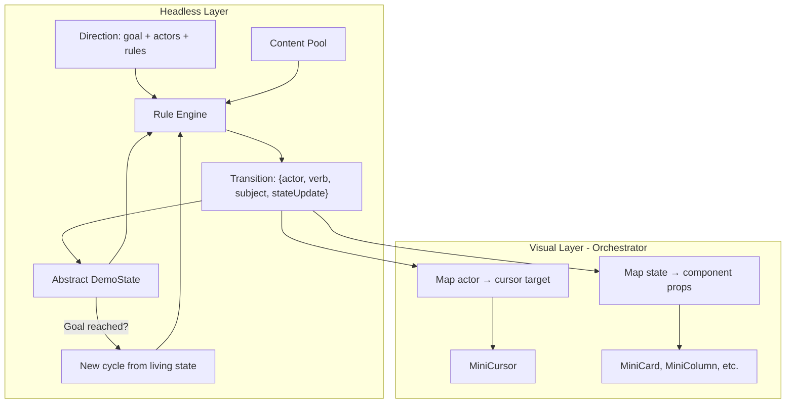

# Rule-Based Demo Engine

## Core Concept

Instead of a hardcoded `SEQUENCE: Step[]`, each demo defines:

1. **A Direction** — the goal state (e.g. "Linear ticket created + sent to Cursor")
2. **Actors** — who participates (Sarah, Arvid, David) with their capabilities
3. **Rules** — what each actor CAN do given the current state
4. **Content pools** — requirements, questions, answers to draw from

The engine evaluates rules each tick, picks the next logical action, executes it, and advances. When the direction's goal is reached, it starts a new cycle from the living state (no reset, no fade, just a new actor starts doing something).

## Architecture: Headless Engine + Visual Orchestrator

The engine is **completely headless**. It has no knowledge of React components, DOM elements, cursor targets, CSS, or anything visual. It operates purely on abstract state and rules.




**The engine never knows:**

- What components exist
- What cursor targets are called
- What the UI layout looks like
- How transitions are animated

**The engine only knows:**

- Abstract state (IDs, counts, selections — no DOM references)
- Rules (pure functions on state)
- Actors (names and capability sets)
- Content pools (data to draw from)

**The orchestrator translates:**

- `{ actor: 'sarah', verb: 'select', subject: 'r3' }` → move cursor to `data-cursor-target="req-r3"`, then set selected prop
- `{ actor: 'arvid', verb: 'generate', subject: 'q1' }` → move cursor to `data-cursor-target="q-column-body"`, then show question card

This separation means the same engine could drive a completely different UI without changing any rules.

## The State Machine

### DemoState (abstract, no UI concepts)

```typescript
interface DemoState {
  requirements: string[];
  selectedRequirement: string | null;
  questions: Record<string, string[]>;
  acceptedQuestions: string[];
  selectedQuestion: string | null;
  answers: Record<string, string[]>;
  summaryGenerated: boolean;
  completeness: number;
  modalPhase: null | 'open' | 'importing' | 'extracting' | 'suggestions' | 'selected';
  exports: string[];
}
```

No `scrollPositions`, no `target`, no visual concept. Just data.

### Transitions (not "actions")

The engine emits **transitions**, not UI actions:

```typescript
interface Transition {
  actor: string;
  verb: string;
  subject: string;
  stateUpdate: (prev: DemoState) => DemoState;
}
```

Verbs are abstract: `'browse'`, `'select'`, `'generate'`, `'accept'`, `'answer'`, `'export'`, `'open'`, `'import'`. Not UI actions like `'show_modal'` or `'scroll_requirements'`.

### Rules

```typescript
interface Rule {
  actor: string;
  canExecute: (state: DemoState) => boolean;
  execute: (state: DemoState, pool: ContentPool) => Transition;
}
```

Rules don't return targets, delays, or anything visual. They return transitions.

Example rules for the hero demo:

```
IF no requirements visible → Sarah scrolls to browse (Settle)
IF requirements visible AND none selected AND no modal → Sarah opens import modal
IF modal open at 'import' → Sarah clicks Import from Slack
IF modal open at 'extracting' → Arvid analyzes (loading state)
IF modal open at 'suggestions' → Arvid selects a suggestion
IF modal just closed AND new req exists → Sarah selects the new requirement
IF requirement selected AND no questions → Arvid generates questions
IF questions exist AND none accepted → David scrolls, accepts some
IF questions accepted AND none selected → David selects one
IF question selected AND no answers → David provides an answer
IF answers exist AND no summary completeness → Arvid generates summary
IF completeness > 0 AND no Linear ticket → David sends to Linear
IF Linear ticket AND no Cursor send → David sends to Cursor
IF Cursor sent → GOAL REACHED → start new cycle
```

### Direction

Each demo's direction defines:

```typescript
interface Direction {
  goal: (state: DemoState) => boolean;  // when is the cycle "done"
  actors: Actor[];
  rules: Rule[];
  contentPool: ContentPool;
  timingConfig: {
    cursorMoveDelay: number;    // 600-800ms
    actionDelay: number;        // 400-600ms
    pauseDelay: number;         // 1000-1400ms
  };
}
```

For the hero demo:

```typescript
const heroDirection: Direction = {
  goal: (s) => s.exports.includes('cursor'),
  actors: [sarah, arvid, david],
  rules: heroRules,
  contentPool: heroContent,
};
```

For the GitHub demo:

```typescript
const githubDirection: Direction = {
  goal: (s) => s.acceptedQuestions.length >= 2,
  actors: [sarah, arvid],
  rules: githubRules,
  contentPool: githubContent,
};
```

**Timing is NOT in the direction.** The engine has a single ambient timing model from `docs/mda_director.md`. All demos feel the same pace.

## The Engine: `useDemoEngine`

Replaces `useSequence`. A **headless** hook that:

1. Holds `DemoState` in React state
2. On each tick (after a pause), evaluates rules in priority order
3. First matching rule produces a `Transition` (actor + verb + subject + state update)
4. Applies the state update
5. Emits the transition so the orchestrator can animate it
6. Pauses (ambient timing)
7. Checks if goal is reached — if yes, continues from the living state with a new focus
8. Repeat forever

The hook returns:

```typescript
{
  state: DemoState;
  currentTransition: Transition | null;  // what just happened
  activeActor: string | null;            // who is acting right now
}
```

It does NOT return cursor positions, targets, or UI state. The orchestrator maps `state` to component props and maps `currentTransition` to cursor movements.

### No Reset, Ever

When the goal is reached, the engine does NOT clear state. It:

- Shifts focus to unexplored content in the pool
- Starts a new cycle naturally from the living, populated state
- Old content stays visible — new content appears alongside it
- If the pool is exhausted, the engine can retire old items (set them as "completed") and draw fresh ones

The viewer never sees a restart. The demo is truly endless.

## File Structure

```
src/site/components/mini-demo/
├── types.ts                    — add DemoState, Rule, Direction, Actor, ContentPool
├── useDemoEngine.ts            — new hook replacing useSequence
├── rules.ts                    — shared rule primitives (can scroll, can select, etc.)
├── MiniCursor.tsx              — unchanged (target-based)
├── ...existing components...

src/site/components/app-demo/
├── direction.ts                — hero demo direction + rules + content pool
├── AppDemo.tsx                 — orchestrator reads from engine state
├── ...existing sub-components...

src/site/components/github-demo/
├── direction.ts                — github demo direction + rules + content pool
├── GitHubDemo.tsx              — orchestrator reads from engine state
```

## What Changes vs Current System


| Aspect              | Current (scripted)                  | New (rule-based)                                     |
| ------------------- | ----------------------------------- | ---------------------------------------------------- |
| Engine              | Knows about UI (targets, delays)    | Headless — emits abstract transitions only           |
| Timing              | Hardcoded per-step delays           | Single ambient timing model, no per-step config      |
| Content             | Fixed arrays, same every loop       | Content pool, draws different items each cycle       |
| Flow                | Deterministic, identical every time | Rule-evaluated, never the same twice                 |
| Looping             | Reset to empty, visible restart     | Continuous — goal reached starts new focus, no reset |
| Cursor              | Target string in step data          | Orchestrator maps transition.subject to DOM target   |
| Director skill      | Writes beat sheet + SEQUENCE        | Writes Direction (goal + rules + pool)               |
| Script Writer skill | Writes data.ts with steps           | Writes direction.ts with rules + content pool        |


## Migration

- `useSequence` stays for backward compat but is deprecated
- `useDemoEngine` is the new standard
- `mda-director` and `mda-scriptwriter` skills get updated to produce Direction files instead of SEQUENCE arrays
- Existing shared components (`MiniCard`, `MiniColumn`, etc.) are unchanged — SSOT preserved

## Todos

Build in this order:

1. Define types (DemoState, Rule, Direction, ContentPool, Actor)
2. Build `useDemoEngine` hook with rule evaluation loop
3. Write shared rule primitives
4. Write hero direction.ts (rules + content pool)
5. Rewrite AppDemo.tsx to use the engine
6. Write github direction.ts
7. Rewrite GitHubDemo.tsx to use the engine
8. Update skills

