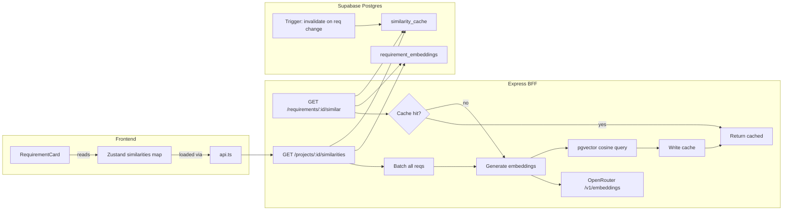

# Semantic Similarity Detection for Requirements

## Figma Reference

The design (node `32-237`) shows the similarity data as a single muted-grey text line on the RequirementCard, positioned between the title and the chip row:

> **Related to R-P88B, R-99AB**

- Font: Inter Medium, 12px, color `#62666A` (maps to `text-text-tertiary`)
- Format: "Related to" prefix + comma-separated short IDs of similar requirements
- Hidden when no similar requirements exist (no empty state needed on the card)

## Architecture Overview



## 1. Database Migration

**File:** `supabase/migrations/YYYYMMDDHHMMSS_add_semantic_similarity.sql`

- Enable `vector` extension (pgvector v0.8.0, already available but not installed)
- Create `requirement_embeddings` table:
  - `requirement_id TEXT PK` references `requirements(id) ON DELETE CASCADE`
  - `embedding vector(1536)` (text-embedding-3-small output dimension)
  - `content_hash TEXT NOT NULL` (SHA-256 of `title || '\n' || description` to detect staleness)
  - `updated_at TIMESTAMPTZ`
- Create `similarity_cache` table:
  - `requirement_id TEXT PK` references `requirements(id) ON DELETE CASCADE`
  - `project_id TEXT NOT NULL` references `projects(id) ON DELETE CASCADE` (indexed, for bulk invalidation)
  - `similar_requirements JSONB NOT NULL` (array of `{id, title, score, snippet}`)
  - `computed_at TIMESTAMPTZ`
- Postgres trigger function `invalidate_similarity_cache()`:
  - Fires `AFTER INSERT OR UPDATE OF title, description, is_deactivated, project_id OR DELETE` on `requirements`
  - Deletes all `similarity_cache` rows matching the affected `project_id`
  - On DELETE, also removes the `requirement_embeddings` row
- RLS disabled on both tables (accessed exclusively via `supabaseAdmin`)

## 2. Server: Embedding Function

**File:** New `server/embeddings.ts` (separate from `openrouter.ts` for separation of concerns)

- `generateEmbeddings(texts: string[]): Promise<number[][]>` -- batch embedding via OpenRouter
  - `POST https://openrouter.ai/api/v1/embeddings`
  - Model: `openai/text-embedding-3-small` (1536 dimensions, $0.02/M tokens)
  - Uses existing `OPENROUTER_API_KEY` from env
  - Input: array of strings (batch API supports multiple inputs)
  - Error handling: log + throw on failure
- `contentHash(title: string, description?: string): string` -- deterministic hash of requirement content
  - Concatenates `title + '\n' + (description || '')`
  - Returns hex SHA-256 via Node `crypto`

## 3. Server: REST Endpoints

**File:** Add to [server/routes/requirements.ts](server/routes/requirements.ts) and [server/routes/projects.ts](server/routes/projects.ts)

### Endpoint A: `GET /api/requirements/:id/similar` (single requirement)

Flow:
1. Load the target requirement via `createUserClient` (RLS-secured)
2. Verify it exists and is not deactivated
3. Check `similarity_cache` via `supabaseAdmin`:
   - If `computed_at` is within 24 hours, return `similar_requirements` JSON
4. On cache miss:
   a. Fetch all active requirements in the same `project_id` (excluding self, excluding `is_deactivated = true`)
   b. For each (including the target), check `requirement_embeddings` for a matching `content_hash`
   c. Batch-generate embeddings for any stale or missing entries via `generateEmbeddings()`
   d. Upsert new embeddings into `requirement_embeddings`
   e. Run pgvector cosine similarity query:
      ```sql
      SELECT r.id, r.short_id, r.title,
             1 - (e1.embedding <=> e2.embedding) AS score
      FROM requirements r
      JOIN requirement_embeddings e2 ON e2.requirement_id = r.id
      CROSS JOIN requirement_embeddings e1
      WHERE e1.requirement_id = :targetId
        AND r.id != :targetId
        AND r.project_id = :projectId
        AND r.is_deactivated = false
        AND 1 - (e1.embedding <=> e2.embedding) >= 0.3
      ORDER BY score DESC
      LIMIT 5
      ```
   f. Cache the result in `similarity_cache`
   g. Return the results

### Endpoint B: `GET /api/projects/:id/similarities` (batch for all cards)

This is the endpoint the frontend calls after loading requirements. It returns all cached similarities for every requirement in the project, computing any that are missing.

Flow:
1. Verify project access via `createUserClient`
2. Fetch all active requirements in the project
3. Check `similarity_cache` for each; compute missing ones (reusing the same embedding + cosine logic)
4. Return a map: `{ [requirementId]: SimilarRequirement[] }`

This avoids N+1 requests from the frontend (one per card).

### Response shapes

```typescript
// Single endpoint
{ similar: Array<{ id: string; shortId: string; title: string; score: number }> }

// Batch endpoint
{ similarities: Record<string, Array<{ id: string; shortId: string; title: string; score: number }>> }
```

## 4. Shared Schema

**File:** New `shared/schemas/similarity.ts` + export from [shared/schemas/index.ts](shared/schemas/index.ts)

- `SimilarRequirementSchema` (Zod): `{ id, shortId, title, score }`
- `SimilarRequirementsResponseSchema`: `{ similar: SimilarRequirement[] }`
- `ProjectSimilaritiesResponseSchema`: `{ similarities: Record<string, SimilarRequirement[]> }`
- Corresponding TypeScript types

## 5. Frontend: API Layer

**File:** [src/app/api.ts](src/app/api.ts)

- `getSimilarRequirements(requirementId: string): Promise<SimilarRequirement[]>` -- single requirement
- `getProjectSimilarities(projectId: string): Promise<Record<string, SimilarRequirement[]>>` -- batch for all cards

## 6. Frontend: Store

**File:** [src/app/store/slices/entities.ts](src/app/store/slices/entities.ts)

- Add `similarities: Record<string, SimilarRequirement[]>` to `EntitiesSlice`
- Add `loadSimilarities(projectId: string)` action that calls `api.getProjectSimilarities()`
- Call `loadSimilarities` after `loadEntities` completes (when `project_id` is available)
- Add `selectSimilarities` selector to [src/app/store/selectors.ts](src/app/store/selectors.ts)

## 7. Frontend: RequirementCard (compact)

**File:** [src/app/components/RequirementCard.tsx](src/app/components/RequirementCard.tsx)

Per the Figma design (node `32-237`), add a single text line between the title `<h3>` (line 71) and the chip row `<div>` (line 74):

- Read `similarities[req.id]` from the store
- If non-empty, render: `Related to R-P88B, R-99AB` (comma-separated `shortId`s)
- Style: `text-caption-lg text-text-tertiary` (12px Inter Medium, color `#62666A`)
- Each short ID is a clickable span that calls `selectRequirement(id)` + `onClick()` to navigate
- If empty or loading: render nothing (no skeleton, no empty state on the card)

## 8. Frontend: DetailsModal (detailed section)

**File:** [src/app/components/DetailsModal.tsx](src/app/components/DetailsModal.tsx)

Add a "Related Requirements" section to the **Details tab** (`renderDetailsTab`), below the existing Properties grid (after line ~383). Only shown when `isReq` and similarities exist:

- Section header: uppercase tracking-widest label "Related Requirements" (matching existing "Metadata" / "Properties" headers)
- Each similar requirement rendered as a clickable card-style row (consistent with the assignee rows pattern):
  - Short ID badge (e.g. `R-P88B`) on the left
  - Requirement title (truncated)
  - Similarity score as a subtle right-aligned percentage (e.g. `87%`)
- Clicking a row closes the modal and selects that requirement
- Separated from Properties with `border-t border-border-subtle`
- Empty state: no section rendered (clean)

## Key Decisions

- **pgvector over application-level cosine**: pgvector is available on Supabase, gives efficient SQL-level similarity with proper indexing, and avoids moving large float arrays over the wire
- **Content hash for staleness**: Instead of re-embedding on every request, hash `title+description` to detect when an embedding is stale -- only re-embed changed requirements
- **Batch embedding**: OpenRouter's embeddings endpoint accepts arrays, so we batch all missing/stale embeddings in one call per `/similar` request
- **supabaseAdmin for embeddings/cache tables**: These are internal optimization tables, not user data. Access control is enforced at the requirement level via RLS on the `requirements` table read
- **Batch project endpoint**: A dedicated `GET /projects/:id/similarities` endpoint avoids N+1 requests from the frontend when rendering all RequirementCards
- **Zustand store for similarities**: Because every RequirementCard needs this data, it belongs in the global store (not view-local state). Loaded once per project alongside entities
- **Postgres trigger over Edge Functions**: Simpler, no additional infrastructure, fires on all mutation paths (API, direct SQL, migrations)

## Risks and Mitigations

- **First-request latency for large projects**: A project with 50 requirements needs embedding all of them on first use. Mitigated by OpenRouter batch API and 24h caching. Could add a HNSW index later if projects grow beyond ~200 requirements
- **OpenRouter embedding cost**: text-embedding-3-small is $0.02/M tokens. A typical requirement (title + description) is ~100 tokens. 50 requirements = 5,000 tokens = $0.0001 per project. Negligible
