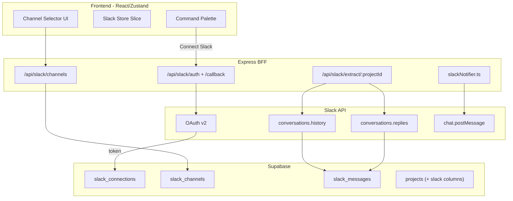

# Slack Integration for Message Extraction and Notifications

## Architecture Overview



---

## 1. Supabase Schema (via Dashboard/SQL Editor)

Three new tables plus columns on `projects`:

**`slack_connections`** (mirrors `github_connections` / `linear_connections`):
- `id` uuid PK default gen_random_uuid()
- `user_id` uuid FK -> auth.users, unique
- `team_id` text (Slack workspace ID)
- `team_name` text
- `access_token` text (bot token from OAuth v2)
- `authed_user_id` text (Slack user ID)
- `bot_user_id` text
- `scopes` text
- `created_at` timestamptz default now()
- `updated_at` timestamptz default now()

RLS: `user_id = auth.uid()` for select; service role for insert/update.

**`slack_channels`** (cached channel metadata per connection):
- `id` uuid PK default gen_random_uuid()
- `slack_channel_id` text (Slack's channel ID)
- `connection_id` uuid FK -> slack_connections
- `project_id` uuid FK -> projects (nullable, set when linked)
- `name` text
- `is_private` boolean
- `is_im` boolean default false
- `member_count` int
- `last_synced_at` timestamptz
- unique on (connection_id, slack_channel_id)

**`slack_messages`** (extracted messages):
- `id` uuid PK default gen_random_uuid()
- `project_id` uuid FK -> projects, not null
- `channel_id` uuid FK -> slack_channels
- `slack_ts` text (Slack message timestamp / unique ID)
- `thread_ts` text nullable (parent thread ts)
- `user_id` text (Slack user ID)
- `username` text
- `text` text
- `reactions` jsonb default '[]'
- `extracted_at` timestamptz default now()
- unique on (channel_id, slack_ts)

**`projects` additions:**
- `slack_notification_channel_id` uuid FK -> slack_channels (nullable)

---

## 2. Server Implementation

### 2a. OAuth Route — `server/routes/slack.ts`

Follow the exact pattern from [`server/routes/github.ts`](server/routes/github.ts) and [`server/routes/linear.ts`](server/routes/linear.ts):

- `GET /api/slack/auth` — generate state, store in `pendingOAuthStates`, return Slack authorize URL with scopes: `channels:read`, `channels:history`, `groups:read`, `groups:history`, `im:read`, `im:history`, `chat:write`, `users:read`
- `GET /api/slack/callback` (mounted before `requireAuth` in `server/index.ts`) — validate state, exchange code via `https://slack.com/api/oauth.v2.access`, upsert `slack_connections`, redirect to `APP_ORIGIN?slack_connected=true`
- `GET /api/slack/status` — return connection status for current user
- `DELETE /api/slack/connect` — delete from `slack_connections`
- `GET /api/slack/channels` — call `conversations.list` (types: public_channel, private_channel, mpim, im), paginate, cache to `slack_channels`, return list
- `POST /api/slack/extract/:projectId` — extract messages (see 2b)
- `PATCH /api/slack/notify-channel/:projectId` — set `slack_notification_channel_id` on project

### 2b. Message Extraction — `server/lib/slackClient.ts`

Utility module wrapping Slack Web API calls:
- `fetchChannelHistory(token, channelId, limit=100)` — `conversations.history` with cursor pagination, minimum 100 messages
- `fetchThreadReplies(token, channelId, threadTs)` — `conversations.replies`
- `resolveUsernames(token, userIds)` — `users.info` batch (cache in-memory per extraction)
- Retry logic: 3x exponential backoff (1s, 2s, 4s) on 429/5xx, respect `Retry-After` header

The extract endpoint:
1. Load `slack_connections` for user
2. Load linked `slack_channels` for the project
3. For each channel: fetch history, fetch replies for threads, resolve usernames
4. Upsert into `slack_messages` (conflict on `channel_id + slack_ts`)
5. Return extraction summary (count per channel)

### 2c. Notifications — `server/lib/slackNotifier.ts`

A focused module called from existing routes when events fire:

```typescript
interface SlackNotification {
  projectId: string;
  eventType: 'question_posed' | 'question_answered' | 'requirement_created' | 'summary_generated';
  title: string;
  summary: string;
  entityId: string;
  url: string; // deep link to app
}
```

- Loads project's `slack_notification_channel_id` -> resolves `slack_channel_id`
- Loads the owning user's `slack_connections.access_token`
- Posts via `chat.postMessage` using Slack Block Kit (section + context block with event type, timestamp, link button)
- Graceful no-op if no notification channel configured

Integration points (add calls in existing routes):
- [`server/routes/questions.ts`](server/routes/questions.ts) `POST /` — question posed
- [`server/routes/answers.ts`](server/routes/answers.ts) `POST /` — question answered
- [`server/routes/summaries.ts`](server/routes/summaries.ts) `POST /generate/:requirementId` — summary generated

### 2d. Middleware — `server/middleware/requireAuth.ts`

Add `requireSlack` middleware (same pattern as `requireGitHub`/`requireLinear`) that loads `access_token` from `slack_connections` into `req.slackToken`.

---

## 3. Shared Schemas — `shared/schemas/`

New files following existing patterns ([`shared/schemas/githubConnection.ts`](shared/schemas/githubConnection.ts), [`shared/schemas/linearConnection.ts`](shared/schemas/linearConnection.ts)):

- **`shared/schemas/slackConnection.ts`** — `SlackConnectionRowSchema`, `SlackConnectionSchema` (API-facing, no token)
- **`shared/schemas/slackChannel.ts`** — `SlackChannelRowSchema`, `SlackChannelSchema`
- **`shared/schemas/slackMessage.ts`** — `SlackMessageRowSchema`, `SlackMessageSchema`
- Update **`shared/schemas/project.ts`** — add `slack_notification_channel_id` field
- Update **`shared/schemas/index.ts`** barrel exports

---

## 4. Frontend Store — `src/app/store/slices/slack.ts`

New Zustand slice (same shape as [`src/app/store/slices/github.ts`](src/app/store/slices/github.ts)):

```typescript
interface SlackSlice {
  slackConnection: SlackConnection | null;
  slackChannels: SlackChannel[];
  slackDataState: DataState;
  extractionStatus: Record<string, 'idle' | 'extracting' | 'done' | 'error'>;

  loadSlackStatus: () => Promise<void>;
  loadSlackChannels: () => Promise<void>;
  disconnectSlack: () => Promise<void>;
  extractMessages: (projectId: string) => Promise<void>;
  setNotificationChannel: (projectId: string, channelId: string) => Promise<void>;
}
```

Register in [`src/app/store/index.ts`](src/app/store/index.ts) composite store.

---

## 5. Frontend API — `src/app/api.ts`

Add functions mirroring existing GitHub/Linear patterns:
- `getSlackStatus()`, `disconnectSlack()`, `getSlackChannels()`
- `extractSlackMessages(projectId)`, `setSlackNotificationChannel(projectId, channelId)`

---

## 6. Frontend UI

### 6a. Command Palette — [`src/app/components/command-palette/useCommands.ts`](src/app/components/command-palette/useCommands.ts)

Add to Integrations category:
- "Connect Slack" (when no connection) -> `requestModal('connectSlack')`
- "Disconnect Slack" (when connected) -> `requestModal('disconnectSlack')`
- "Select Slack Channels" (when connected + project selected) -> opens channel picker
- "Extract Slack Messages" (when channels linked) -> triggers extraction

### 6b. Channel Selector Modal

New component `src/app/components/SlackChannelPicker.tsx`:
- Lists channels from store (public/private/DM with icons)
- Multi-select for extraction sources
- Single-select for notification channel
- Uses [`BaseModal`](src/app/components/BaseModal.tsx) pattern

### 6c. Update Existing Components

- [`src/app/components/ImportFromSlack.tsx`](src/app/components/ImportFromSlack.tsx) — replace placeholder with real OAuth trigger
- [`src/app/App.tsx`](src/app/App.tsx) — handle `?slack_connected=true` query param (same as GitHub pattern), call `loadSlackStatus()`
- [`src/app/components/Sidebar.tsx`](src/app/components/Sidebar.tsx) — show Slack connection indicator

---

## 7. Infrastructure — `render.yaml`

Add env vars to the `arvid-api` service:

```yaml
- key: SLACK_CLIENT_ID
  sync: false
- key: SLACK_CLIENT_SECRET
  sync: false
- key: SLACK_SIGNING_SECRET
  sync: false
```

---

## 8. Constraints and Edge Cases

- **One workspace per user** — `slack_connections` has unique on `user_id`; re-connecting replaces the existing token
- **Rate limits** — Slack Tier 3 APIs (conversations.history) allow ~50 req/min; the retry utility with exponential backoff + `Retry-After` header respect handles this
- **Permissions** — if bot lacks access to a channel, surface user-friendly error via toast (not silent failure)
- **Extraction trigger** — on-demand via command palette or channel picker "Extract Now" button; no background scheduler in v1
- **Token refresh** — Slack bot tokens (from OAuth v2 with `token_rotation_enabled=false`) do not expire; no refresh flow needed unless token rotation is enabled on the Slack app

---

## 9. File Change Summary

| Action | Path |
|--------|------|
| Create | `server/routes/slack.ts` |
| Create | `server/lib/slackClient.ts` |
| Create | `server/lib/slackNotifier.ts` |
| Create | `shared/schemas/slackConnection.ts` |
| Create | `shared/schemas/slackChannel.ts` |
| Create | `shared/schemas/slackMessage.ts` |
| Create | `src/app/store/slices/slack.ts` |
| Create | `src/app/components/SlackChannelPicker.tsx` |
| Modify | `server/index.ts` (mount slack routes + callback) |
| Modify | `server/middleware/requireAuth.ts` (add `requireSlack`) |
| Modify | `server/routes/questions.ts` (notification call) |
| Modify | `server/routes/answers.ts` (notification call) |
| Modify | `server/routes/summaries.ts` (notification call) |
| Modify | `shared/schemas/index.ts` (exports) |
| Modify | `shared/schemas/project.ts` (notification channel field) |
| Modify | `src/app/api.ts` (slack API functions) |
| Modify | `src/app/store/index.ts` (compose SlackSlice) |
| Modify | `src/app/store/selectors.ts` (slack selectors) |
| Modify | `src/app/components/command-palette/useCommands.ts` (slack commands) |
| Modify | `src/app/components/ImportFromSlack.tsx` (real implementation) |
| Modify | `src/app/App.tsx` (handle slack_connected param) |
| Modify | `src/app/components/Sidebar.tsx` (slack indicator) |
| Modify | `render.yaml` (env vars) |
| Modify | `package.json` (add `@slack/web-api` dependency) |
