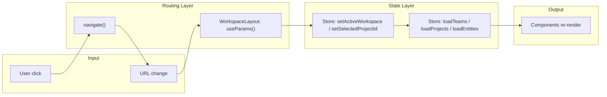

# URL-Based Navigation Routing

## Coherent Short ID System

Every entity in the hierarchy gets a human-readable short ID with a single-letter prefix:

| Entity | Prefix | Example | Scope |
|--------|--------|---------|-------|
| Workspace | W | W01, W02 | Global per user |
| Team | T | T01, T02 | Per workspace |
| Project | P | P01, P02 | Per user (existing) |
| Requirement | R | R01, R02 | Per project (existing) |
| Question | Q | Q01, Q02 | Per requirement (existing) |
| Answer | A | A01, A02 | Per question (existing) |
| Summary | S | S01 | Per requirement (existing) |

The full address of a requirement: `W01/T01/P01/R03` -- a compact path through the entire knowledge graph. This is powerful for vector embeddings, cross-references, and LLM context windows.

## URL Structure

```
/                          -> redirect to /W01
/W01                       -> workspace W01, no team/project
/W01/T01                   -> workspace W01, team T01, no project
/W01/T01/P01               -> workspace W01, team T01, project P01 (full context)
/login                     -> login page (unchanged)
```

Examples:
- `/W01` -- first workspace
- `/W01/T01` -- first team in first workspace
- `/W01/T01/P01` -- first project in first team
- `/W02/T01/P03` -- second workspace, first team, third project

Uses short IDs for all three levels -- consistent, compact, unambiguous.

---

## Database: Add short_id to workspaces and teams

**Migration**: Add `short_id` column (text, nullable initially) to `workspaces` and `teams`.

For **workspaces**, scope is global per user (`created_by`):
```sql
ALTER TABLE public.workspaces ADD COLUMN short_id text;
```

For **teams**, scope is per workspace (`workspace_id`):
```sql
ALTER TABLE public.teams ADD COLUMN short_id text;
```

**Data migration**: generate short IDs for existing rows using the `W` and `T` prefixes with the existing `formatShortId` pattern (W01, W02, T01, T02).

**Server routes**: update [server/routes/workspaces.ts](server/routes/workspaces.ts) POST handler to call `nextShortId(db, 'workspaces', 'W', 'created_by', userId)` and [server/routes/teams.ts](server/routes/teams.ts) POST handler to call `nextShortId(db, 'teams', 'T', 'workspace_id', workspaceId)`.

**Schemas**: add `short_id` to `WorkspaceRowSchema`/`WorkspaceSchema` and `TeamRowSchema`/`TeamSchema` (same pattern as `ProjectRowSchema`).

---

## State Ownership (R1: SSOT, R12: Predictable State Ownership)

The URL is the **sole source of truth** for navigation context. The Zustand store reflects it but does not own it:

- **URL owns**: which workspace, team, project are active
- **Store owns**: the loaded data (workspace list, team list, project list, entities)
- **Flow is one-way**: URL -> `WorkspaceLayout` reads params -> store actions called -> components render

No component may call `setActiveWorkspace` or `setSelectedProjectId` directly. All navigation changes go through `navigate()`, which updates the URL, which triggers `WorkspaceLayout` to sync the store.

**Exception (R21)**: `WorkspaceLayout` calls store actions (`setActiveWorkspace`, `setSelectedProjectId`) as an explicit bridge between the URL and the store. This is documented here as the sole authorized caller. The store actions remain available for programmatic use (e.g., invitation accept flow) but must immediately be followed by a `navigate()` to keep the URL in sync.

---

## Data Flow (R8: Unidirectional)



No circular paths. `WorkspaceLayout` never calls `navigate()` -- it only reads and syncs downward. Only user actions and explicit redirects (WorkspaceRedirect, invitation accept) call `navigate()`.

---

## Domain: Path Building (R2: Separation, R4: No Hardcoding)

**New file** [src/app/domain/paths.ts](src/app/domain/paths.ts):

Pure, deterministic path construction functions. No imports from store/api/UI. All URL path patterns are centralized here -- no component may hardcode path strings.

```ts
function buildWorkspacePath(workspaceShortId: string): string       // -> "/W01"
function buildTeamPath(wsShortId: string, teamShortId: string): string  // -> "/W01/T01"
function buildProjectPath(wsShortId: string, teamShortId: string, projectShortId: string): string  // -> "/W01/T01/P01"
function buildProjectPathFromEntities(workspace: Workspace, teams: Team[], project: Project): string
```

`buildProjectPathFromEntities` resolves the team's `shortId` from the project's `teamId` via the teams array -- used by Sidebar and auto-select logic.

**Test file** [src/app/domain/paths.test.ts](src/app/domain/paths.test.ts):

Unit tests for all path builders -- valid inputs, missing team fallback, correct prefix handling.

---

## Implementation

### 1. Route definition in [src/main.tsx](src/main.tsx)

Replace the catch-all `/*` with explicit nested routes using short IDs:

```tsx
<Routes>
  <Route path="/login" element={<LoginPage />} />
  <Route path="/" element={<AuthGuard><App /></AuthGuard>}>
    <Route index element={<WorkspaceRedirect />} />
    <Route path=":wsShortId" element={<WorkspaceLayout />}>
      <Route index element={null} />
      <Route path=":teamShortId" element={null} />
      <Route path=":teamShortId/:projectShortId" element={null} />
    </Route>
  </Route>
</Routes>
```

The nested `WorkspaceLayout` reads route params (`W01`, `T01`, `P01`) and syncs them to the store. The inner routes are purely for param extraction. The actual UI (Sidebar + columns) remains in `App` via `<Outlet />`.

### 2. WorkspaceRedirect (R6: own file, R19: logging)

**New file** [src/app/components/WorkspaceRedirect.tsx](src/app/components/WorkspaceRedirect.tsx):

On mount, resolves the user's default workspace and redirects:
- Call `loadWorkspaces()` if not loaded, wait for `workspacesDataState.status === 'ready'`
- `navigate(buildWorkspacePath(firstWorkspace.shortId), { replace: true })`
- Log at `info` level: `[navigation:redirect] Redirecting to default workspace { shortId }`
- If workspaces are empty, auto-create triggers in `loadWorkspaces`, then redirects on re-render

### 3. WorkspaceLayout (R6: own file, R14: explicit side effects, R19: logging)

**New file** [src/app/components/WorkspaceLayout.tsx](src/app/components/WorkspaceLayout.tsx):

A routing infrastructure component (not a UI component -- renders no visible elements, only `<Outlet />`). Reads `useParams()` and syncs URL segments to the store via `useEffect`:

- `wsShortId` (e.g. `W01`) -> find workspace by `shortId` in `workspaces` array -> `setActiveWorkspace(id)` if changed
- `teamShortId` (e.g. `T01`) -> resolve for URL validation; no store state needed (teams are sidebar groupings)
- `projectShortId` (e.g. `P01`) -> find project by `shortId` in `projects` array -> `setSelectedProjectId(id)` if changed

All side effects in `useEffect` -- no state sync during render (R14).

Fallback behavior:
- Unknown workspace short ID -> `navigate('/', { replace: true })`, log warning
- Unknown team short ID -> non-fatal, stay on workspace view
- Unknown project short ID -> non-fatal, no project selected

Logging (R19): every navigation sync logs at `debug` level: `[navigation:sync] Resolved URL params { wsShortId, teamShortId, projectShortId }`.

### 4. Update navigation to use `navigate()` + domain helpers (R4)

All navigation now uses the centralized `buildProjectPath` / `buildWorkspacePath` from `domain/paths.ts`. No hardcoded path strings in components.

**[src/app/components/WorkspacePicker.tsx](src/app/components/WorkspacePicker.tsx)**:
```ts
import { buildWorkspacePath } from '../domain/paths';
const handleSelect = (ws) => navigate(buildWorkspacePath(ws.shortId));
```

**[src/app/components/Sidebar.tsx](src/app/components/Sidebar.tsx)**:
```ts
import { buildProjectPathFromEntities } from '../domain/paths';
onClick={() => navigate(buildProjectPathFromEntities(activeWorkspace, teams, project))
```
Where `buildProjectPathFromEntities` resolves `W01/T01/P01` from the entity objects.

The auto-select effect on project load also navigates with the full path instead of directly setting store state.

### 5. Update [src/app/App.tsx](src/app/App.tsx)

- Remove the `loadWorkspaces` call on mount (moved to WorkspaceRedirect/WorkspaceLayout)
- Remove the `selectedProjectId` effect that calls `loadEntities` (moved to WorkspaceLayout)
- Keep the OAuth callback param handling (reads query params, then navigates to current path)
- The invite accept flow navigates to `buildWorkspacePath(acceptedWorkspace.shortId)` after resolving

### 6. Remove localStorage persistence (R1: URL is the sole truth)

Delete [src/app/lib/navigation.ts](src/app/lib/navigation.ts). Remove all references:
- `saveNavigation()` from `setActiveWorkspace` and `setSelectedProjectId`
- `loadNavigation()` from `loadWorkspaces` and Sidebar auto-select
- `clearNavigation()` from `AuthProvider.signOut`

### 7. OAuth callback redirects

OAuth callbacks redirect to `/?github_connected=1`. Update to preserve workspace context by including the current path. In the OAuth auth URL generation, pass `redirectTo: window.location.pathname + '?github_connected=1'`.

### 8. Invitation accept redirect

After `acceptPendingInvitations` resolves, navigate to the accepted workspace: `navigate(buildWorkspacePath(acceptedWorkspace.shortId))`.

---

## Files Summary

**Database (1 migration)**:
- `supabase/migrations/YYYYMMDD_add_short_ids_to_workspaces_teams.sql` -- add `short_id` column, populate existing rows

**New files (3)**:
- `src/app/domain/paths.ts` -- centralized path-building helpers (R2, R4)
- `src/app/components/WorkspaceRedirect.tsx` -- resolves default workspace and redirects (R6)
- `src/app/components/WorkspaceLayout.tsx` -- syncs URL params to store (R6)

**Test files (1)**:
- `src/app/domain/paths.test.ts` -- unit tests for path builders (R20)

**Modified files (10)**:
- `src/main.tsx` -- nested route structure with `W01/T01/P01` params
- `src/app/App.tsx` -- remove workspace/project loading (delegated to layout)
- `src/app/components/Sidebar.tsx` -- navigate with `buildProjectPath` on click
- `src/app/components/WorkspacePicker.tsx` -- navigate with `buildWorkspacePath` on switch
- `src/app/store/slices/selection.ts` -- remove localStorage save
- `src/app/store/slices/workspaces.ts` -- remove localStorage save/restore
- `src/app/auth/AuthProvider.tsx` -- remove clearNavigation
- `shared/schemas/workspace.ts` -- add `short_id` to row/domain schema
- `shared/schemas/team.ts` -- add `short_id` to row/domain schema
- `server/routes/workspaces.ts` -- generate `W##` short ID on create
- `server/routes/teams.ts` -- generate `T##` short ID on create
- `docs/architecture.md` -- document routing pattern and short ID system

**Removed files (1)**:
- `src/app/lib/navigation.ts` -- replaced by URL

---

## Master Rules Compliance Checklist

- **R1 SSOT**: URL is the single source of navigation truth; store reflects it, does not own it
- **R2 Separation**: path building in `domain/paths.ts` (domain layer); URL-to-store sync in `WorkspaceLayout` (infrastructure); UI components only call `navigate()`
- **R4 No Hardcoding**: all path patterns centralized in `domain/paths.ts`; no string concatenation in components
- **R6 No Inline Components**: WorkspaceRedirect and WorkspaceLayout are separate files
- **R8 Unidirectional Flow**: URL -> WorkspaceLayout -> store -> render. No circular navigation.
- **R12 Predictable Ownership**: URL owns navigation; store owns data; components consume both
- **R14 No Hidden Side Effects**: all URL-to-store sync in explicit `useEffect` hooks
- **R16 Explicit Errors**: unknown slugs logged and handled (redirect or graceful fallback)
- **R19 Debug Logging**: WorkspaceRedirect and WorkspaceLayout log navigation transitions at debug/info level
- **R20 Testing**: unit tests for path-building domain helpers
- **R21 Documented Exception**: WorkspaceLayout is the sole authorized caller of `setActiveWorkspace`/`setSelectedProjectId` from URL params

## Backward Compatibility

- `/` redirects to the default workspace, so existing bookmarks to the root still work
- `/login` is unchanged
- The `render.yaml` SPA rewrite (`/* -> /index.html`) ensures all routes resolve to the app
- OAuth callback URLs with query params still work (they land on the app, params are read, then navigated away)
