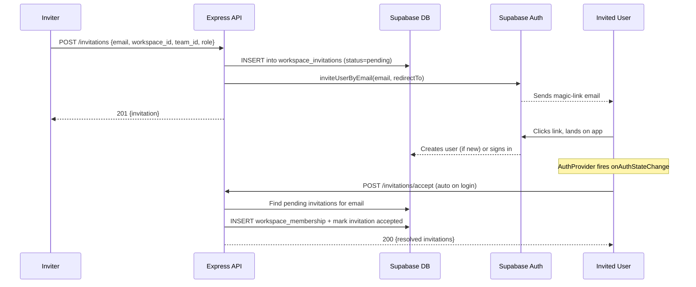

# Workspace Invitation Flow

## Problem

The current "Invite Member" flow only adds existing Supabase users by email lookup. It sends no email, has no pending state, and fails silently for users who haven't signed up yet.

## Design



---

## Database

New table `workspace_invitations`:

- `id` uuid PK default `gen_random_uuid()`
- `workspace_id` uuid FK -> `workspaces(id)` ON DELETE CASCADE
- `team_id` uuid FK -> `teams(id)` ON DELETE SET NULL, nullable
- `email` text NOT NULL
- `role` text NOT NULL CHECK (role IN ('admin', 'member'))
- `status` text NOT NULL DEFAULT 'pending' CHECK (status IN ('pending', 'accepted', 'expired'))
- `invited_by` uuid FK -> `auth.users(id)` NOT NULL
- `created_at` timestamptz DEFAULT now()
- `expires_at` timestamptz DEFAULT now() + interval '7 days'
- Unique constraint: `(workspace_id, email)` WHERE `status = 'pending'`

RLS policies (using existing `private.user_workspace_ids()` and `private.user_workspace_role()` helpers to avoid recursion):

- SELECT: `workspace_id IN (SELECT private.user_workspace_ids())` (workspace members can list invitations)
- INSERT: `private.user_workspace_role(workspace_id) IN ('owner', 'admin')`
- DELETE: `private.user_workspace_role(workspace_id) IN ('owner', 'admin')`

The accept endpoint uses the service-role client (`supabase`) to find invitations by email and create memberships, bypassing RLS since the invited user has no membership yet.

**Compliance: Rule 4 (No Hardcoding)** -- the `'7 days'` expiration default lives in the DB column default. The server route reads `expires_at` from the row; no hardcoded duration in application code.

---

## Shared Schemas (Rule 1: SSOT, Rule 13: Validation at Boundaries)

Zod schemas are the single source of truth for invitation shape, consumed by both client and server.

**New file** [shared/schemas/invitation.ts](shared/schemas/invitation.ts):

- `InvitationStatusEnum` -- `z.enum(['pending', 'accepted', 'expired'])` (Rule 9: explicit states)
- `InvitationRowSchema` -- matches DB columns (snake_case), all fields typed
- `InvitationSchema` -- `.transform()` to camelCase domain model
- `CreateInvitationBodySchema` -- `{ workspace_id: uuid, team_id?: uuid, email: email, role: enum('admin','member') }`
- Types: `InvitationStatus`, `InvitationRow`, `Invitation`

**Updated** [shared/schemas/index.ts](shared/schemas/index.ts) -- re-export all invitation schemas and types

**Updated** [src/app/types.ts](src/app/types.ts) -- re-export `Invitation`, `InvitationStatus`

---

## Domain Logic (Rule 2: Separation of Concerns)

**New file** [src/app/domain/invitations.ts](src/app/domain/invitations.ts):

Pure, stateless, deterministic business logic (no imports from store/api/UI):

- `isInvitationExpired(expiresAt: string): boolean` -- compares against current time
- `isInvitationPending(invitation: Invitation): boolean` -- checks status and expiry
- `getInvitationStatusLabel(status: InvitationStatus): string` -- human-readable labels from enum constant map
- `canSendInvitation(role: WorkspaceRole): boolean` -- returns `hasMinimumRole(role, 'admin')` (delegates to existing [src/app/domain/workspaces.ts](src/app/domain/workspaces.ts))

No business decisions in the UI layer or route handlers -- they delegate to these functions.

---

## Server Routes (Rule 2: Infrastructure Layer, Rule 16: Explicit Errors, Rule 19: Logging)

**New file** [server/routes/invitations.ts](server/routes/invitations.ts):

Follows the existing router pattern: `Router()` + `createUserClient(req.accessToken!)` + `validateBody()` + structured error responses with codes.

| Method | Path | Description | Auth |
|--------|------|-------------|------|
| GET | `/?workspace_id=` | List pending invitations | User client (RLS) |
| POST | `/` | Create invitation + send email | User client for insert; service client for `inviteUserByEmail` |
| DELETE | `/:id` | Cancel pending invitation | User client (RLS) |
| POST | `/accept` | Accept all pending invitations for current user | Service client (no membership yet) |

**POST `/`** flow:
1. Validate body via `CreateInvitationBodySchema`
2. Check for existing pending invitation (duplicate guard) -> 400 `ALREADY_INVITED`
3. Check if user is already a workspace member -> 400 `ALREADY_MEMBER`
4. Insert invitation row via user client (RLS enforces admin/owner)
5. Call `supabase.auth.admin.inviteUserByEmail(email, { redirectTo, data: { workspace_id, team_id } })` -- explicit side effect, logged at `info` level
6. If `inviteUserByEmail` returns "user already registered" error, the invitation row still exists; log at `info` and return 201 (invitation created, email still sent by Supabase for existing users via magic link)
7. Return 201 with invitation row

**POST `/accept`** flow:
1. Get `req.user.email` from auth middleware
2. Service-role query: find all `workspace_invitations` WHERE `email = req.user.email AND status = 'pending' AND expires_at > now()`
3. For each: insert `workspace_membership` (workspace_id, user_id, role) via service client, update invitation `status = 'accepted'`
4. Idempotent: if membership already exists (unique constraint), skip and still mark accepted (Rule 10: idempotent)
5. Return list of accepted invitations (or empty array if none)

**Error codes** (Rule 16):
- `ALREADY_INVITED` -- pending invitation exists for this email+workspace
- `ALREADY_MEMBER` -- user is already a workspace member
- `INVITATION_NOT_FOUND` -- invitation does not exist or is not pending
- `INVITATION_EXPIRED` -- invitation past `expires_at`

**Logging** (Rule 19): every async operation logs start, success, and failure using the structured format `[level] [invitations:operation] message { context }`. Email addresses are logged only at `debug` level (not in production).

**Mount** in [server/index.ts](server/index.ts): `app.use('/api/invitations', invitationsRouter)` -- after `requireAuth`, same as other data routes.

---

## API Client (Rule 13: Validation at Boundaries)

Add to [src/app/api.ts](src/app/api.ts):

- `getInvitations(workspaceId, signal?)` -- `request` + `parseArray(InvitationRowSchema, InvitationSchema, ...)`
- `sendInvitation(workspaceId, teamId, email, role)` -- `request` + `parseSingle(...)`
- `cancelInvitation(id)` -- `request<void>('DELETE', ...)`
- `acceptInvitations()` -- `request` + `parseArray(...)` (returns accepted invitations)

All responses validated through Zod `safeParse` on the transform schema, matching the existing pattern for projects/requirements/etc.

---

## Store (Rule 1: SSOT, Rule 9: State Machines, Rule 12: State Ownership)

Invitation state lives exclusively in `WorkspacesSlice` (SSOT -- not duplicated elsewhere):

**State additions** to [src/app/store/slices/workspaces.ts](src/app/store/slices/workspaces.ts):

```
invitations: Invitation[]
invitationsDataState: { status: 'idle' | 'loading' | 'ready' | 'error', error?: string }
acceptInvitationsState: { status: 'idle' | 'resolving' | 'resolved' | 'error' }
```

**Actions**:
- `loadInvitations(workspaceId)` -- fetch + set, follows `idle -> loading -> ready | error` machine
- `sendInvitation(workspaceId, teamId, email, role)` -- POST + append to list on success
- `cancelInvitation(id)` -- optimistic remove from list, rollback on failure
- `acceptPendingInvitations()` -- guarded by `acceptInvitationsState` to prevent double-fire (Rule 10: idempotent, no overlapping requests); on success, reloads workspaces so newly-joined workspaces appear

The `acceptInvitationsState` machine prevents race conditions: `idle -> resolving -> resolved | error`. Once in `resolved`, subsequent calls are no-ops.

---

## UI Components (Rule 2: UI Layer, Rule 5: No Inline Styling, Rule 6: No Inline Components)

### InviteMemberModal

Update [src/app/components/InviteMemberModal.tsx](src/app/components/InviteMemberModal.tsx):
- Add team picker (dropdown of teams from `selectTeams`, defaulting to first team)
- Change submit from `addMember` to `sendInvitation` store action
- On success: close modal (store action already appended the invitation)
- On error: display API error message inline
- All styling via design system tokens (no inline styles)

### PendingInvitationList (new component -- Rule 6)

**New file** [src/app/components/PendingInvitationList.tsx](src/app/components/PendingInvitationList.tsx):

Extracted as its own named component (not an inline render function inside WorkspaceSettingsModal). Receives data via props:

```ts
interface PendingInvitationListProps {
  invitations: Invitation[];
  teams: Team[];
  canManage: boolean;
  onCancel: (id: string) => void;
}
```

- No business logic -- renders invitations, delegates cancel to parent via callback
- Each row: email, role badge (`rounded-pill`), team name (derived from `teams` prop), relative date, cancel button
- Dashed border style for pending state: `border-dashed border-border-default`
- Empty state: "No pending invitations"

### WorkspaceSettingsModal

Update Members tab in [src/app/components/WorkspaceSettingsModal.tsx](src/app/components/WorkspaceSettingsModal.tsx):
- Load invitations via `loadInvitations(activeWorkspaceId)` in the existing `useEffect`
- Render `<PendingInvitationList>` below the active members list, passing `invitations`, `teams`, `canManage`, and `onCancel={cancelInvitation}`
- No inline component definitions -- `PendingInvitationList` is imported

---

## Auto-Accept on Login (Rule 8: Unidirectional Flow, Rule 10: Race Conditions)

In [src/app/App.tsx](src/app/App.tsx):

After auth is confirmed, call `acceptPendingInvitations()` once. The store action's state machine (`idle -> resolving -> resolved`) ensures:
- It runs exactly once per session (not on every re-render)
- It does not overlap with itself
- It reloads workspaces on success so newly-joined workspaces appear in the sidebar

Flow: `Auth confirmed -> acceptPendingInvitations() -> reload workspaces -> Sidebar picks up new workspace`

No side effects during render -- the call is inside a `useEffect` with proper dependency tracking.

---

## Handling New vs Existing Users

- **New user**: `supabase.auth.admin.inviteUserByEmail()` creates the user in `auth.users` with a magic-link email. Clicking the link lands on `app.arvid.work`, Supabase Auth resolves the session, `onAuthStateChange` fires `SIGNED_IN`, the `acceptPendingInvitations()` effect resolves their invitation into a real membership.
- **Existing user**: `inviteUserByEmail()` for an existing email still sends a magic-link. The invitation row exists in `workspace_invitations`. On their next sign-in (via any method), `acceptPendingInvitations()` finds and resolves it.

Both paths converge at the same `POST /invitations/accept` endpoint -- no branching logic in the frontend.

---

## Testing (Rule 20)

### Unit Tests
- [shared/schemas/invitation.test.ts](shared/schemas/invitation.test.ts) -- schema parsing: valid rows, invalid emails, status enum enforcement, transform correctness
- [src/app/domain/invitations.test.ts](src/app/domain/invitations.test.ts) -- `isInvitationExpired` with past/future dates, `isInvitationPending` with various statuses, `canSendInvitation` role checks

### Integration Tests (future)
- API contract: POST creates invitation + returns valid schema
- Accept flow: pending invitation resolves to membership

---

## Files Summary

**New files (4)**:
- `shared/schemas/invitation.ts` -- Zod schemas + types
- `server/routes/invitations.ts` -- CRUD + accept endpoint
- `src/app/domain/invitations.ts` -- pure business logic
- `src/app/components/PendingInvitationList.tsx` -- extracted UI component

**Test files (2)**:
- `shared/schemas/invitation.test.ts`
- `src/app/domain/invitations.test.ts`

**Modified files (7)**:
- `shared/schemas/index.ts` -- re-export invitation schemas
- `src/app/types.ts` -- re-export Invitation type
- `server/index.ts` -- mount invitations router
- `src/app/api.ts` -- add invitation API methods with Zod validation
- `src/app/store/slices/workspaces.ts` -- invitation state + state machines + actions
- `src/app/App.tsx` -- call acceptPendingInvitations on mount
- `src/app/components/InviteMemberModal.tsx` -- team picker + sendInvitation
- `src/app/components/WorkspaceSettingsModal.tsx` -- integrate PendingInvitationList

**Database (1 migration)**:
- CREATE `workspace_invitations` table + RLS policies

---

## Master Rules Compliance Checklist

- **R1 SSOT**: invitation state lives only in `WorkspacesSlice`; invitation shape defined only in `shared/schemas/invitation.ts`
- **R2 Separation**: UI renders via props, state in Zustand slice, business logic in `domain/invitations.ts`, infrastructure in `api.ts` + server routes
- **R4 No Hardcoding**: expiration default in DB column; roles via `InvitationStatusEnum`; error codes as named constants
- **R5 No Inline Styling**: all new components use design system tokens
- **R6 No Inline Components**: `PendingInvitationList` is its own file, not an anonymous function inside WorkspaceSettingsModal
- **R7 Reusable**: `PendingInvitationList` accepts data via props, no context assumptions
- **R8 Unidirectional Flow**: User action -> store action -> API -> state update -> re-render
- **R9 Explicit State Machines**: `invitationsDataState` and `acceptInvitationsState` with named states and deterministic transitions
- **R10 Race Conditions**: `acceptPendingInvitations` guarded by state machine; server accept is idempotent
- **R13 Validation at Boundaries**: Zod schemas validate server ingress (body) and client responses (parseArray/parseSingle)
- **R14 No Hidden Side Effects**: email sending is an explicit, logged step in the POST route
- **R16 Explicit Errors**: structured error codes (ALREADY_INVITED, ALREADY_MEMBER, INVITATION_EXPIRED, INVITATION_NOT_FOUND)
- **R19 Debug Logging**: all routes and store actions use structured logger with start/success/failure
- **R20 Testing**: unit tests for schema and domain logic
