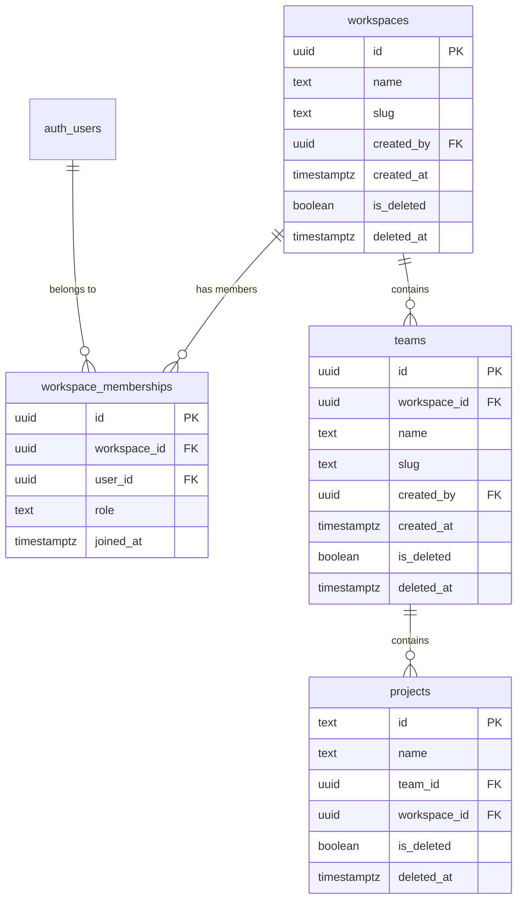

# Workspaces > Teams > Projects Hierarchy

## Current State

The app is a single-user system. `projects.user_id = auth.uid()` is the sole ownership model. There are no workspaces, teams, or membership concepts. Projects live in `projects` with a `parent_id` self-FK. All RLS policies check `user_id = auth.uid()` directly.

No Supabase migration files exist in the repo -- the schema was created outside version control.

## Data Model



### Table Details

**`workspaces`**
- `id` uuid PK default `gen_random_uuid()`
- `name` text NOT NULL
- `slug` text NOT NULL UNIQUE (generated from name, lowercase, hyphenated)
- `created_by` uuid FK -> `auth.users(id)` NOT NULL
- `created_at` timestamptz default `now()`
- `is_deleted` boolean default false
- `deleted_at` timestamptz nullable
- Unique constraint: `(slug)` WHERE `is_deleted = false`

**`workspace_memberships`**
- `id` uuid PK default `gen_random_uuid()`
- `workspace_id` uuid FK -> `workspaces(id)` ON DELETE CASCADE
- `user_id` uuid FK -> `auth.users(id)` ON DELETE CASCADE
- `role` text NOT NULL CHECK (`role IN ('owner', 'admin', 'member')`)
- `joined_at` timestamptz default `now()`
- Unique constraint: `(workspace_id, user_id)`

**`teams`**
- `id` uuid PK default `gen_random_uuid()`
- `workspace_id` uuid FK -> `workspaces(id)` ON DELETE CASCADE
- `name` text NOT NULL
- `slug` text NOT NULL
- `created_by` uuid FK -> `auth.users(id)` NOT NULL
- `created_at` timestamptz default `now()`
- `is_deleted` boolean default false
- `deleted_at` timestamptz nullable
- Unique constraint: `(workspace_id, slug)` WHERE `is_deleted = false`

**`projects` (alter existing)**
- ADD `team_id` uuid FK -> `teams(id)` ON DELETE SET NULL, nullable
- ADD `workspace_id` uuid FK -> `workspaces(id)` ON DELETE CASCADE, nullable (initially -- will become NOT NULL after migration)
- ADD `is_deleted` boolean default false
- ADD `deleted_at` timestamptz nullable
- Unique constraint: `(workspace_id, name)` WHERE `is_deleted = false`

### Defaults on Creation

1. **New user signup** -> auto-create a personal workspace ("My Workspace"), an "owner" membership, a default team ("General"), and a default project ("My Project")
2. **New workspace** -> auto-create a default team ("General") and add creator as "owner" membership
3. **New team** -> auto-create a default project ("{Team Name} Project")

This logic will live in Express route handlers (not DB triggers) to keep business logic explicit and testable per master rules.

### Soft Delete Pattern

All soft-deletable tables use `is_deleted` boolean + `deleted_at` timestamptz. API queries always filter `is_deleted = false`. The Express handler sets both fields atomically. No cascade on soft delete -- children are soft-deleted explicitly in the route handler within a transaction-like sequence.

---

## Phase 1: Database Migration

Create a single migration file via Supabase CLI (`supabase migration new add_workspaces_teams`).

**SQL contents:**
1. CREATE `workspaces` table with columns above
2. CREATE `workspace_memberships` table
3. CREATE `teams` table
4. ALTER `projects` to add `team_id`, `workspace_id`, `is_deleted`, `deleted_at`
5. Add partial unique indexes for soft-delete-aware uniqueness
6. Enable RLS on all new tables

### RLS Policies

**`workspaces`:**
- SELECT: user is a member of the workspace (`EXISTS (SELECT 1 FROM workspace_memberships wm WHERE wm.workspace_id = workspaces.id AND wm.user_id = auth.uid())`)
- INSERT: `created_by = auth.uid()`
- UPDATE: user is owner or admin of the workspace
- DELETE: user is owner

**`workspace_memberships`:**
- SELECT: user is a member of the same workspace
- INSERT: user is owner or admin of the workspace
- UPDATE: user is owner (for role changes)
- DELETE: user is owner or admin (cannot remove last owner)

**`teams`:**
- SELECT: user is a member of the parent workspace
- INSERT: user is owner or admin of the parent workspace
- UPDATE: user is owner or admin of the parent workspace
- DELETE: user is owner or admin of the parent workspace

**`projects`** (updated):
- SELECT: user is a member of the project's workspace
- INSERT: user is owner or admin of the project's workspace
- UPDATE: user is a member of the project's workspace (existing + workspace membership check)
- DELETE: user is owner or admin of the project's workspace

### Data Migration

For existing users/projects, run a migration that:
1. Creates a personal workspace for each distinct `user_id` in `projects`
2. Creates an owner membership for that user
3. Creates a default team in that workspace
4. Updates all existing projects to reference the new `workspace_id` and `team_id`
5. Removes the `user_id` column from `projects` (or retains it as `created_by` if needed for audit)

---

## Phase 2: Shared Schemas

Follow the existing triple-schema pattern (Row, Domain, Mutation) in [shared/schemas/project.ts](shared/schemas/project.ts).

### New Files

**`shared/schemas/workspace.ts`**
- `WorkspaceRowSchema` -- matches DB columns (snake_case)
- `WorkspaceSchema` -- transforms to camelCase domain model
- `CreateWorkspaceBodySchema` -- `{ name: string }`
- `UpdateWorkspaceBodySchema` -- `{ name?: string }`
- Export types: `WorkspaceRow`, `Workspace`

**`shared/schemas/team.ts`**
- `TeamRowSchema` -- workspace_id, name, slug, created_by, etc.
- `TeamSchema` -- camelCase transform
- `CreateTeamBodySchema` -- `{ name: string, workspace_id: string }`
- `UpdateTeamBodySchema` -- `{ name?: string }`
- Export types: `TeamRow`, `Team`

**`shared/schemas/membership.ts`**
- `MembershipRowSchema` -- workspace_id, user_id, role, joined_at
- `MembershipSchema` -- camelCase transform
- `CreateMembershipBodySchema` -- `{ workspace_id: string, user_id: string, role: string }`  
- `UpdateMembershipBodySchema` -- `{ role: string }`
- Export types: `MembershipRow`, `Membership`

### Modified Files

**`shared/schemas/project.ts`** -- add `team_id`, `workspace_id`, `is_deleted`, `deleted_at` to `ProjectRowSchema`; add `teamId`, `workspaceId` to `ProjectSchema` transform; update mutation schemas.

**`shared/schemas/index.ts`** -- re-export all new schemas and types.

---

## Phase 3: Express API Routes

Follow the pattern in [server/routes/projects.ts](server/routes/projects.ts): Router per entity, `createUserClient(req.accessToken!)`, `validateBody()` middleware, structured error responses.

### New Route Files

**`server/routes/workspaces.ts`**

| Method | Path | Description | Validation |
|--------|------|-------------|------------|
| GET | `/` | List workspaces for current user (via membership) | -- |
| GET | `/:id` | Get single workspace | -- |
| POST | `/` | Create workspace + default team + owner membership | `CreateWorkspaceBodySchema` |
| PATCH | `/:id` | Update workspace (name/slug) | `UpdateWorkspaceBodySchema` |
| DELETE | `/:id` | Soft-delete workspace + cascade soft-delete teams/projects | -- |

On POST: generate slug from name, create workspace, insert owner membership, create default "General" team, create default project under team.

**`server/routes/teams.ts`**

| Method | Path | Description | Validation |
|--------|------|-------------|------------|
| GET | `/?workspace_id=` | List teams in workspace | -- |
| GET | `/:id` | Get single team | -- |
| POST | `/` | Create team + default project | `CreateTeamBodySchema` |
| PATCH | `/:id` | Update team name | `UpdateTeamBodySchema` |
| DELETE | `/:id` | Soft-delete team + cascade soft-delete projects | -- |

**`server/routes/memberships.ts`**

| Method | Path | Description | Validation |
|--------|------|-------------|------------|
| GET | `/?workspace_id=` | List members of workspace | -- |
| POST | `/` | Add member to workspace | `CreateMembershipBodySchema` |
| PATCH | `/:id` | Update member role | `UpdateMembershipBodySchema` |
| DELETE | `/:id` | Remove member from workspace | -- |

### Modified Files

**`server/routes/projects.ts`**
- POST: accept `team_id` and `workspace_id` in body; remove `user_id` assignment
- GET `/`: filter by `workspace_id` query param, exclude `is_deleted = true`
- DELETE: soft-delete instead of hard delete
- All queries add `.eq('is_deleted', false)`

**`server/index.ts`** -- mount new routers:
```
app.use('/api/workspaces', workspacesRouter);
app.use('/api/teams', teamsRouter);
app.use('/api/memberships', membershipsRouter);
```

### Error Handling Pattern

All CRUD endpoints return structured 400 errors for constraint violations:
```json
{
  "error": "A team with this name already exists in the workspace",
  "code": "DUPLICATE_NAME"
}
```

Specific codes: `DUPLICATE_NAME`, `LAST_OWNER`, `NOT_MEMBER`, `INSUFFICIENT_ROLE`, `HAS_CHILDREN` (for delete attempts on non-empty entities -- though soft-delete will cascade).

---

## Phase 4: Frontend State Layer

### New Zustand Slice

**`src/app/store/slices/workspaces.ts`**

State:
- `workspaces: Workspace[]`
- `workspacesDataState: { status: 'idle' | 'loading' | 'ready' | 'error', error?: string }`
- `activeWorkspaceId: string | null`
- `teams: Team[]`
- `teamsDataState: DataState`
- `members: Membership[]`

Actions:
- `loadWorkspaces()` -- fetch all, select first if none active
- `setActiveWorkspace(id)` -- switch workspace, reload teams and projects
- `createWorkspace(name)` -- POST + append to list
- `updateWorkspace(id, name)` -- optimistic update
- `deleteWorkspace(id)` -- soft delete + remove from list
- `loadTeams(workspaceId)` -- fetch teams for active workspace
- `createTeam(name, workspaceId)` -- POST + append
- `updateTeam(id, name)` -- optimistic update
- `deleteTeam(id)` -- soft delete + remove
- `loadMembers(workspaceId)` -- fetch members
- `addMember(workspaceId, email, role)` -- POST
- `updateMemberRole(id, role)` -- PATCH
- `removeMember(id)` -- DELETE

### Modified Slices

**`src/app/store/slices/projects.ts`**
- `loadProjects()` now accepts `workspaceId` parameter, filters by workspace
- `createProject()` accepts `teamId` and `workspaceId`
- `deleteProject()` performs soft delete

**`src/app/store/index.ts`** -- compose new `WorkspacesSlice` into `AppState`.

### API Client Additions

**`src/app/api.ts`** -- add methods:
- `getWorkspaces()`, `createWorkspace()`, `updateWorkspace()`, `deleteWorkspace()`
- `getTeams(workspaceId)`, `createTeam()`, `updateTeam()`, `deleteTeam()`
- `getMembers(workspaceId)`, `addMember()`, `updateMemberRole()`, `removeMember()`

All follow the existing `request()` + `parseArray()`/`parseSingle()` pattern.

---

## Phase 5: Frontend UI

### Sidebar Changes

The [Sidebar](src/app/components/Sidebar.tsx) currently shows a flat project list. It needs a workspace context:

1. **Workspace Picker** -- dropdown at the top of the sidebar showing the active workspace name with a chevron. Clicking opens a dropdown to switch workspaces or create a new one.
2. **Team Grouping** -- projects in the sidebar are grouped by team. Each team is a collapsible section header.
3. **Settings Gear** -- icon button next to workspace name opens workspace settings modal.

### New Components

**`src/app/components/WorkspacePicker.tsx`**
- Dropdown showing list of workspaces the user belongs to
- "Create Workspace" option at the bottom
- Shows active workspace name + role badge

**`src/app/components/WorkspaceSettingsModal.tsx`**
- Uses `BaseModal` with `size="xl"`
- Tab navigation: General | Teams | Members
- **General tab**: rename workspace, danger zone (delete workspace)
- **Teams tab**: list teams, create/rename/delete buttons, each team shows project count
- **Members tab**: list members with role badges, invite by email, change role dropdown, remove button

**`src/app/components/CreateWorkspaceModal.tsx`**
- Name input with slug preview
- Creates workspace + redirects to it

**`src/app/components/CreateTeamModal.tsx`**
- Name input, parent workspace auto-set from context
- `BaseModal` size `sm`

**`src/app/components/InviteMemberModal.tsx`**
- Email input + role selector (admin/member)
- `BaseModal` size `sm`

### Modified Components

**`src/app/components/Sidebar.tsx`**
- Replace the "Projects" header with the `WorkspacePicker`
- Group projects under team headers
- Add gear icon for workspace settings

**`src/app/components/NewProjectModal.tsx`**
- Add team selector (dropdown of teams in the active workspace)
- Default to the first team

**`src/app/App.tsx`**
- Load workspaces on mount
- Pass `activeWorkspaceId` context down

---

## Phase 6: Data Migration for Existing Users

A one-time migration (can be run as a Supabase SQL migration or a server-side script):

1. For each distinct `user_id` in `projects`:
   - Create workspace: `{ name: 'My Workspace', slug: 'my-workspace', created_by: user_id }`
   - Create membership: `{ workspace_id, user_id, role: 'owner' }`
   - Create team: `{ workspace_id, name: 'General', slug: 'general', created_by: user_id }`
   - UPDATE all projects for that user: SET `workspace_id`, `team_id`, `is_deleted = false`
2. After migration, ALTER `projects` to make `workspace_id` NOT NULL

---

## File Summary

### New Files (14)
- `supabase/migrations/YYYYMMDDHHMMSS_add_workspaces_teams.sql`
- `shared/schemas/workspace.ts`
- `shared/schemas/team.ts`
- `shared/schemas/membership.ts`
- `server/routes/workspaces.ts`
- `server/routes/teams.ts`
- `server/routes/memberships.ts`
- `src/app/store/slices/workspaces.ts`
- `src/app/components/WorkspacePicker.tsx`
- `src/app/components/WorkspaceSettingsModal.tsx`
- `src/app/components/CreateWorkspaceModal.tsx`
- `src/app/components/CreateTeamModal.tsx`
- `src/app/components/InviteMemberModal.tsx`
- `src/app/domain/workspaces.ts` (slug generation, role checks)

### Modified Files (10)
- `shared/schemas/project.ts` -- add team_id, workspace_id, soft-delete fields
- `shared/schemas/index.ts` -- re-export new schemas
- `server/routes/projects.ts` -- workspace/team scoping, soft delete
- `server/index.ts` -- mount new routers
- `src/app/api.ts` -- add workspace/team/membership API methods
- `src/app/types.ts` -- re-export new types
- `src/app/store/index.ts` -- compose workspaces slice
- `src/app/store/slices/projects.ts` -- workspace-aware loading, soft delete
- `src/app/components/Sidebar.tsx` -- workspace picker, team grouping
- `src/app/components/NewProjectModal.tsx` -- team selector

---

## Constraints and Rules Compliance

- **SSOT**: workspace/team/membership state lives only in the `workspaces` Zustand slice; no duplication
- **Separation of Concerns**: UI components receive data via props/store selectors; business logic (slug generation, role checks) in `domain/workspaces.ts`; API in `api.ts`; DB via Express routes
- **No Hardcoding**: role values as enum constants, error codes as constants
- **No Inline Styling**: all new components use design system tokens from `theme.css`
- **Validation at Boundaries**: Zod schemas validate all API inputs and outputs
- **Explicit State Machines**: workspace data loading uses `idle -> loading -> ready | error`
- **Debug Logging**: all new routes and store actions use the structured logger
- **Soft Delete**: `is_deleted` + `deleted_at` pattern, no hard deletes on workspace/team/project
